# TÀI LIỆU PHÂN TÍCH VÀ THIẾT KẾ HỆ THỐNG
# HỆ THỐNG QUẢN LÝ THƯ VIỆN TRỰC TUYẾN (Online Library Management)

**Môn học:** Nhập môn Công nghệ Phần mềm  
**Phương pháp:** Unified Process (UP)  
**Ngày tạo:** 06/05/2026

---

# GIAI ĐOẠN 1 – REQUIREMENTS TOÀN HỆ THỐNG

---

## 1. Bảng thuật ngữ

| STT | Thuật ngữ | Định nghĩa / Giải thích |
|-----|-----------|--------------------------|
| 1 | Thư viện trực tuyến (Online Library) | Hệ thống phần mềm cho phép người dùng tìm kiếm, duyệt và mượn sách qua giao diện web, không cần đến trực tiếp thư viện vật lý |
| 2 | Người dùng (User) | Người đã đăng ký tài khoản trong hệ thống với vai trò USER, có quyền tìm kiếm sách, quản lý giỏ sách và tạo yêu cầu mượn |
| 3 | Quản trị viên (Admin) | Người dùng có vai trò ADMIN, có quyền duyệt/từ chối yêu cầu mượn sách, xem nhật ký hệ thống và thực hiện các thao tác quản trị |
| 4 | Khách (Guest) | Người truy cập hệ thống chưa đăng nhập, chỉ có thể tìm kiếm và xem thông tin sách, không thể mượn sách |
| 5 | Sách (Book) | Đối tượng chính của hệ thống, chứa thông tin như tiêu đề, tác giả, ISBN, mô tả, năm xuất bản, chủ đề, số bản sao |
| 6 | Phiếu mượn (Loan) | Bản ghi yêu cầu mượn sách của người dùng, trải qua các trạng thái: PENDING → APPROVED → RETURNED hoặc CANCELLED/REJECTED |
| 7 | Giỏ sách (Cart) | Danh sách tạm thời các sách mà người dùng muốn mượn, được lưu trữ trên Redis hoặc bộ nhớ tạm, tồn tại cho đến khi checkout |
| 8 | Checkout | Thao tác chuyển đổi toàn bộ sách trong giỏ thành các phiếu mượn (trạng thái PENDING) và xóa giỏ sách |
| 9 | Bản sao khả dụng (Available Copies) | Số lượng bản sao của một cuốn sách còn có thể cho mượn tại thời điểm hiện tại; giảm khi duyệt mượn, tăng khi trả/hủy |
| 10 | Trạng thái phiếu mượn (Loan Status) | Giá trị mô tả tình trạng hiện tại của phiếu mượn: PENDING (chờ duyệt), APPROVED (đã duyệt), RETURNED (đã trả), CANCELLED (đã hủy), REJECTED (bị từ chối) |
| 11 | OpenLibrary API | Dịch vụ API bên ngoài (openlibrary.org) cung cấp dữ liệu hàng triệu cuốn sách, được hệ thống tích hợp để tìm kiếm và lấy thông tin sách |
| 12 | Redis | Hệ thống lưu trữ dữ liệu dạng key-value trong bộ nhớ, được sử dụng để cache kết quả API, quản lý giỏ sách và giới hạn tần suất truy cập |
| 13 | Cache | Bộ nhớ đệm lưu trữ tạm thời kết quả truy vấn API để giảm thời gian phản hồi và tải cho hệ thống bên ngoài |
| 14 | Trigger | Cơ chế tự động của CSDL, thực thi một hành động khi có sự kiện xảy ra trên bảng dữ liệu (VD: giới hạn số phiếu mượn, ghi nhật ký) |
| 15 | Nhật ký hệ thống (Audit Log) | Bảng ghi lại mọi thay đổi trạng thái của phiếu mượn, bao gồm: bảng bị thay đổi, giá trị cũ/mới, người thực hiện, thời điểm |
| 16 | Duyệt hàng loạt (Bulk Approve) | Chức năng cho phép Admin duyệt nhiều phiếu mượn cùng lúc trong một giao dịch nguyên tử |
| 17 | Chuyển phiếu mượn (Transfer Loan) | Chức năng chuyển quyền sở hữu một phiếu mượn đang ở trạng thái PENDING sang người dùng khác |
| 18 | Hạn trả (Due Date) | Ngày hết hạn mượn sách, được tự động tính bằng ngày duyệt + 14 ngày |
| 19 | Xác thực (Authentication) | Quá trình xác minh danh tính người dùng thông qua username và password, trả về token truy cập |
| 20 | Phân quyền (Authorization) | Cơ chế kiểm soát quyền truy cập dựa trên vai trò (role) của người dùng: USER hoặc ADMIN |
| 21 | Sách xu hướng (Trending Books) | Danh sách các sách đang được quan tâm nhiều nhất, lấy từ OpenLibrary API endpoint trending/daily |
| 22 | Chủ đề (Subject) | Phân loại sách theo lĩnh vực nội dung (VD: Science Fiction, Programming, History), dùng để duyệt sách theo nhóm |

---

## 2. Mô hình nghiệp vụ bằng ngôn ngữ tự nhiên

### 2.1. Mục tiêu và phạm vi hệ thống

Hệ thống **Quản lý Thư viện Trực tuyến (Online Library Management)** được xây dựng nhằm số hóa và tự động hóa quy trình quản lý mượn trả sách tại các thư viện trường học, trường đại học hoặc các tổ chức giáo dục. Thay vì phải đến trực tiếp thư viện để tra cứu và làm thủ tục mượn sách, người dùng có thể thực hiện toàn bộ quy trình này thông qua giao diện web trực tuyến từ bất kỳ đâu có kết nối internet.

Hệ thống giải quyết các vấn đề chính sau:

- **Tra cứu sách hạn chế:** Thư viện truyền thống yêu cầu người dùng phải đến tận nơi hoặc sử dụng hệ thống nội bộ để tìm sách. Hệ thống này tích hợp với **OpenLibrary API** — cơ sở dữ liệu mở chứa thông tin hàng triệu cuốn sách trên toàn thế giới — cho phép người dùng tìm kiếm theo từ khóa, duyệt theo chủ đề, xem sách xu hướng và tra cứu thông tin chi tiết bao gồm bìa sách, mô tả, tác giả, năm xuất bản.

- **Quy trình mượn sách thủ công:** Hệ thống cung cấp cơ chế **giỏ sách** (tương tự giỏ hàng thương mại điện tử) để người dùng chọn nhiều cuốn sách muốn mượn, sau đó **checkout** để tạo yêu cầu mượn. Quản trị viên sẽ duyệt hoặc từ chối yêu cầu, hệ thống tự động tính ngày hạn trả (14 ngày kể từ ngày duyệt) và cập nhật số bản sao khả dụng.

- **Thiếu kiểm soát và minh bạch:** Hệ thống áp dụng các ràng buộc tự động ở cấp cơ sở dữ liệu (trigger) để giới hạn mỗi người dùng tối đa 5 phiếu mượn hoạt động, tự động ghi nhật ký mọi thay đổi trạng thái phiếu mượn vào bảng audit log, giúp quản trị viên theo dõi và giám sát toàn bộ hoạt động mượn trả.

**Phạm vi áp dụng:** Hệ thống phục vụ hai nhóm người dùng chính — **người mượn sách** (sinh viên, giảng viên, nhân viên) và **quản trị viên thư viện**. Ngoài ra, **khách vãng lai** chưa có tài khoản vẫn có thể tìm kiếm và duyệt thông tin sách. Hệ thống hoạt động dưới dạng ứng dụng web, triển khai bằng Docker và có thể truy cập qua trình duyệt trên mọi thiết bị.

### 2.2. Ai có thể sử dụng phần mềm?

Hệ thống phục vụ ba nhóm người dùng chính và tương tác với một hệ thống bên ngoài:

**Khách (Guest):** Là bất kỳ ai truy cập hệ thống thông qua trình duyệt web mà chưa đăng nhập. Khách có thể tìm kiếm sách bằng từ khóa, xem danh sách sách xu hướng, duyệt sách theo chủ đề và xem thông tin chi tiết của từng cuốn sách (bao gồm bìa, mô tả, tác giả). Tuy nhiên, khách không thể thêm sách vào giỏ, tạo yêu cầu mượn hay truy cập bất kỳ chức năng quản lý nào. Để sử dụng đầy đủ chức năng, khách cần đăng ký tài khoản.

**Người dùng đã đăng ký (User):** Là người đã tạo tài khoản và đăng nhập vào hệ thống với vai trò USER. Ngoài tất cả các chức năng của Khách, Người dùng có thể: thêm sách vào giỏ sách, xóa sách khỏi giỏ, thực hiện checkout để tạo phiếu mượn, xem danh sách phiếu mượn cá nhân (theo trạng thái), hủy phiếu mượn đang chờ duyệt hoặc đã duyệt, và đăng xuất khỏi hệ thống.

**Quản trị viên (Admin):** Là người dùng có vai trò ADMIN, thường là nhân viên thư viện hoặc người quản lý. Admin có toàn bộ quyền của Người dùng, cộng thêm: xem tất cả phiếu mượn trong hệ thống (lọc theo trạng thái), duyệt hoặc từ chối từng phiếu mượn, duyệt hàng loạt nhiều phiếu cùng lúc, chuyển phiếu mượn sang người dùng khác, xác nhận trả sách, xem nhật ký audit ghi lại mọi thay đổi, và nhập sách từ OpenLibrary vào cơ sở dữ liệu nội bộ.

**Hệ thống OpenLibrary API (hệ thống ngoài):** Là dịch vụ API bên ngoài do Internet Archive vận hành, cung cấp dữ liệu sách cho hệ thống. Khi người dùng tìm kiếm hoặc duyệt sách, hệ thống sẽ gửi yêu cầu tới OpenLibrary API để lấy thông tin và hiển thị. Kết quả được cache bởi Redis để giảm tải và tăng tốc phản hồi.

### 2.3. Người dùng có những chức năng gì?

**Khách (Guest):**
- Tìm kiếm sách bằng từ khóa (tiêu đề, tác giả) thông qua thanh tìm kiếm, kết quả hiển thị dạng danh sách có phân trang.
- Xem danh sách sách xu hướng (trending) trên trang chủ.
- Duyệt sách theo chủ đề (subject) như Science Fiction, Programming, History.
- Xem thông tin chi tiết của một cuốn sách: bìa sách, tiêu đề, tác giả, mô tả, năm xuất bản, chủ đề liên quan.
- Xem thông tin tác giả: tiểu sử, ngày sinh, ảnh, liên kết Wikipedia.
- Đăng ký tài khoản mới với username, password và email.
- Đăng nhập vào hệ thống bằng username và password.

**Người dùng (User):** Có tất cả chức năng của Khách, cộng thêm:
- Thêm sách vào giỏ sách (mỗi sách chỉ được thêm một lần, không trùng lặp).
- Xem giỏ sách hiện tại với danh sách các sách đã chọn.
- Xóa sách khỏi giỏ sách.
- Checkout giỏ sách: tạo phiếu mượn cho tất cả sách trong giỏ (trạng thái PENDING) và xóa giỏ.
- Xem danh sách phiếu mượn cá nhân, lọc theo trạng thái (PENDING, APPROVED, RETURNED, CANCELLED).
- Hủy phiếu mượn đang ở trạng thái PENDING hoặc APPROVED.
- Đăng xuất khỏi hệ thống.

**Quản trị viên (Admin):** Có tất cả chức năng của Người dùng, cộng thêm:
- Xem tất cả phiếu mượn trong hệ thống, lọc theo trạng thái.
- Duyệt phiếu mượn: chuyển trạng thái từ PENDING sang APPROVED, tự động gán ngày mượn và ngày hạn trả (+14 ngày), giảm số bản sao khả dụng của sách.
- Từ chối phiếu mượn: chuyển trạng thái sang REJECTED khi sách hết bản sao.
- Duyệt hàng loạt: chọn nhiều phiếu mượn PENDING và duyệt tất cả trong một thao tác.
- Chuyển phiếu mượn: chuyển quyền sở hữu phiếu mượn PENDING sang người dùng khác.
- Xác nhận trả sách: chuyển trạng thái từ APPROVED sang RETURNED, tăng số bản sao khả dụng.
- Xem nhật ký audit: danh sách mọi thay đổi trạng thái phiếu mượn, bao gồm giá trị cũ/mới, người thực hiện, thời điểm.
- Nhập sách từ OpenLibrary vào cơ sở dữ liệu nội bộ.

### 2.4. Mỗi chức năng hoạt động như thế nào?

**Đăng ký tài khoản:** Khách truy cập trang đăng ký, nhập username, password và email. Hệ thống kiểm tra username chưa tồn tại, nếu hợp lệ thì tạo tài khoản mới với vai trò USER mặc định và thông báo thành công. Sau đó khách có thể đăng nhập.

**Đăng nhập:** Người dùng nhập username và password. Hệ thống so khớp thông tin trong CSDL, nếu đúng thì tạo token truy cập, lưu thông tin phiên đăng nhập và chuyển về trang chủ. Token được lưu ở localStorage của trình duyệt.

**Tìm kiếm sách:** Người dùng nhập từ khóa vào thanh tìm kiếm và nhấn Enter. Hệ thống kiểm tra cache Redis trước — nếu có kết quả cache thì trả về ngay, nếu không thì gửi yêu cầu tới OpenLibrary API, lưu kết quả vào cache (TTL 10 phút) và trả về danh sách sách kèm phân trang.

**Xem chi tiết sách:** Người dùng nhấn vào một cuốn sách từ danh sách. Hệ thống lấy thông tin chi tiết từ OpenLibrary API (hoặc cache), hiển thị bìa sách lớn, mô tả đầy đủ, danh sách tác giả, chủ đề, ngày xuất bản. Nếu đã đăng nhập, hiển thị nút "Thêm vào giỏ".

**Thêm sách vào giỏ và Checkout:** Người dùng đã đăng nhập nhấn "Thêm vào giỏ" ở trang chi tiết sách. Hệ thống lưu book_id vào giỏ Redis (hoặc in-memory). Khi muốn mượn, người dùng vào trang Giỏ sách, xem danh sách và nhấn "Checkout". Hệ thống tạo phiếu mượn PENDING cho từng sách, xóa giỏ và thông báo thành công.

**Duyệt phiếu mượn (Admin):** Admin vào trang Quản trị, xem danh sách phiếu mượn PENDING. Nhấn "Approve" cho từng phiếu: hệ thống kiểm tra số bản sao khả dụng, nếu > 0 thì duyệt (gán ngày mượn, ngày trả, giảm bản sao), nếu = 0 thì tự động từ chối. Trigger audit tự động ghi nhật ký.

**Trả sách:** Admin tìm phiếu mượn đã duyệt (APPROVED) và nhấn "Return". Hệ thống chuyển trạng thái sang RETURNED, ghi ngày trả thực tế, tăng số bản sao khả dụng. Trigger audit tự động ghi nhật ký.

**Xem nhật ký:** Admin vào mục Audit Log trên trang Quản trị. Hệ thống truy vấn bảng audit_log và hiển thị danh sách các thay đổi trạng thái gần nhất (giới hạn 50 bản ghi), bao gồm: bảng bị thay đổi, mã bản ghi, hành động, giá trị cũ/mới, thời điểm.

### 2.5. Những thông tin / đối tượng mà hệ thống cần xử lý

**Người dùng (NguoiDung):** Lưu trữ thông tin tài khoản bao gồm mã định danh (id), tên đăng nhập (username) duy nhất, mật khẩu (password), vai trò (role: USER hoặc ADMIN), địa chỉ email và ngày tạo tài khoản. Đây là đối tượng trung tâm liên kết với phiếu mượn và nhật ký.

**Sách (Sach):** Chứa thông tin một cuốn sách trong thư viện bao gồm mã định danh (id), khóa OpenLibrary (openlibrary_key) để liên kết với nguồn dữ liệu bên ngoài, tiêu đề (title), tác giả (author), mã ISBN, đường dẫn ảnh bìa (cover_url), mô tả (description), năm xuất bản (publish_year), danh sách chủ đề (subjects), số bản sao tổng cộng (total_copies) và số bản sao khả dụng (available_copies).

**Phiếu mượn (PhieuMuon):** Đại diện cho một lượt mượn sách, chứa mã định danh (id), mã người mượn (user_id), mã sách (book_id), ngày yêu cầu (request_date), ngày mượn (borrow_date — ngày admin duyệt), ngày hạn trả (due_date — 14 ngày sau ngày duyệt), ngày trả thực tế (return_date), trạng thái (status), mã admin duyệt (approved_by_id) và ghi chú (notes).

**Nhật ký hệ thống (NhatKyHeThong):** Ghi lại mọi thay đổi trạng thái trong hệ thống, bao gồm mã định danh (id), tên bảng bị thay đổi (table_name), mã bản ghi (record_id), loại hành động (action), giá trị cũ (old_value), giá trị mới (new_value), mã người thực hiện (changed_by_id) và thời điểm thay đổi (changed_at).

**Giỏ sách (GioSach):** Danh sách tạm thời các sách người dùng muốn mượn, được lưu trên Redis dưới dạng key-value (key = `cart:{user_id}`, value = danh sách book_id). Giỏ sách không được lưu trữ vĩnh viễn trong CSDL mà chỉ tồn tại trong phiên làm việc của người dùng.

### 2.6. Quan hệ giữa các đối tượng

- **Một Người dùng có thể tạo nhiều Phiếu mượn** (quan hệ 1-n): Mỗi người dùng có thể mượn nhiều cuốn sách khác nhau qua nhiều phiếu mượn, nhưng mỗi phiếu mượn chỉ thuộc về một người dùng. Hệ thống giới hạn tối đa 5 phiếu mượn hoạt động (PENDING + APPROVED) cho mỗi người dùng.

- **Một cuốn Sách có thể xuất hiện trong nhiều Phiếu mượn** (quan hệ 1-n): Mỗi cuốn sách có thể được nhiều người mượn (miễn là còn bản sao khả dụng), nhưng mỗi phiếu mượn chỉ liên quan đến một cuốn sách.

- **Một Quản trị viên (Người dùng với role ADMIN) duyệt nhiều Phiếu mượn** (quan hệ 1-n): Admin là người phê duyệt phiếu mượn, mã admin được ghi vào trường approved_by_id của phiếu. Một admin có thể duyệt nhiều phiếu, mỗi phiếu chỉ được duyệt bởi một admin.

- **Một Phiếu mượn có thể sinh ra nhiều bản ghi Nhật ký** (quan hệ 1-n): Mỗi khi trạng thái phiếu mượn thay đổi (PENDING → APPROVED, APPROVED → RETURNED, v.v.), trigger tự động tạo một bản ghi mới trong bảng Nhật ký. Một phiếu mượn có thể trải qua nhiều lần thay đổi trạng thái.

- **Một Người dùng sở hữu một Giỏ sách** (quan hệ 1-1): Mỗi người dùng có duy nhất một giỏ sách tạm thời lưu trên Redis. Giỏ sách chứa danh sách các mã sách (book_id) mà người dùng muốn mượn.

- **Người dùng và Sách có quan hệ n-n thông qua Phiếu mượn:** Nhiều người dùng có thể mượn cùng một cuốn sách (ở các thời điểm khác nhau), và một người dùng có thể mượn nhiều cuốn sách. Phiếu mượn đóng vai trò là bảng trung gian chứa thông tin chi tiết về lượt mượn.

---

## 3. Mô hình nghiệp vụ bằng UML

### 3.1. Danh sách Actor

| STT | Tên Actor | Loại | Mô tả vai trò |
|-----|-----------|------|----------------|
| 1 | Khách (Guest) | Chính | Người truy cập chưa đăng nhập, có thể tìm kiếm và duyệt thông tin sách |
| 2 | Người dùng (User) | Chính | Người đã đăng ký và đăng nhập, có thể mượn sách, quản lý giỏ sách, xem phiếu mượn |
| 3 | Quản trị viên (Admin) | Chính | Nhân viên thư viện có quyền duyệt/từ chối phiếu mượn, xem nhật ký, quản lý hệ thống |
| 4 | OpenLibrary API | Phụ | Hệ thống bên ngoài cung cấp dữ liệu sách, tác giả, chủ đề |

### 3.2. Các Use Case cho từng Actor

| Mã UC | Tên Use-case | Actor | Mức độ ưu tiên | Mô tả ngắn |
|-------|-------------|-------|----------------|------------|
| UC01 | Đăng ký tài khoản | Khách | Cao | Tạo tài khoản mới với username, password, email |
| UC02 | Đăng nhập | Khách, Người dùng, Admin | Cao | Xác thực bằng username/password, nhận token |
| UC03 | Đăng xuất | Người dùng, Admin | Trung bình | Hủy phiên đăng nhập, xóa token |
| UC04 | Tìm kiếm sách | Khách, Người dùng, Admin | Cao | Tìm sách theo từ khóa qua OpenLibrary API |
| UC05 | Xem sách xu hướng | Khách, Người dùng, Admin | Trung bình | Xem danh sách sách trending trên trang chủ |
| UC06 | Duyệt sách theo chủ đề | Khách, Người dùng, Admin | Trung bình | Xem sách theo nhóm chủ đề |
| UC07 | Xem chi tiết sách | Khách, Người dùng, Admin | Cao | Xem thông tin đầy đủ: bìa, mô tả, tác giả, chủ đề |
| UC08 | Xem thông tin tác giả | Khách, Người dùng, Admin | Thấp | Xem tiểu sử, ảnh, ngày sinh của tác giả |
| UC09 | Thêm sách vào giỏ | Người dùng, Admin | Cao | Thêm sách vào giỏ mượn (Redis), không trùng lặp |
| UC10 | Xóa sách khỏi giỏ | Người dùng, Admin | Trung bình | Xóa một cuốn sách khỏi giỏ mượn |
| UC11 | Xem giỏ sách | Người dùng, Admin | Cao | Xem danh sách sách đã thêm vào giỏ |
| UC12 | Checkout giỏ sách | Người dùng, Admin | Cao | Tạo phiếu mượn PENDING cho tất cả sách trong giỏ |
| UC13 | Xem phiếu mượn cá nhân | Người dùng, Admin | Cao | Xem danh sách phiếu mượn, lọc theo trạng thái |
| UC14 | Hủy phiếu mượn | Người dùng, Admin | Trung bình | Hủy phiếu PENDING hoặc APPROVED |
| UC15 | Duyệt phiếu mượn | Admin | Cao | Duyệt phiếu PENDING → APPROVED, giảm bản sao |
| UC16 | Từ chối phiếu mượn | Admin | Cao | Từ chối phiếu khi sách hết bản sao |
| UC17 | Duyệt hàng loạt | Admin | Trung bình | Duyệt nhiều phiếu PENDING cùng lúc |
| UC18 | Chuyển phiếu mượn | Admin | Thấp | Chuyển phiếu PENDING sang người dùng khác |
| UC19 | Xác nhận trả sách | Admin | Cao | Chuyển APPROVED → RETURNED, tăng bản sao |
| UC20 | Xem nhật ký audit | Admin | Trung bình | Xem lịch sử thay đổi trạng thái phiếu mượn |
| UC21 | Nhập sách từ OpenLibrary | Admin | Thấp | Import sách từ API bên ngoài vào CSDL nội bộ |
| UC22 | Kiểm tra sức khỏe HT | Admin | Thấp | Kiểm tra trạng thái API backend |

### 3.3. Biểu đồ Use Case tổng quan

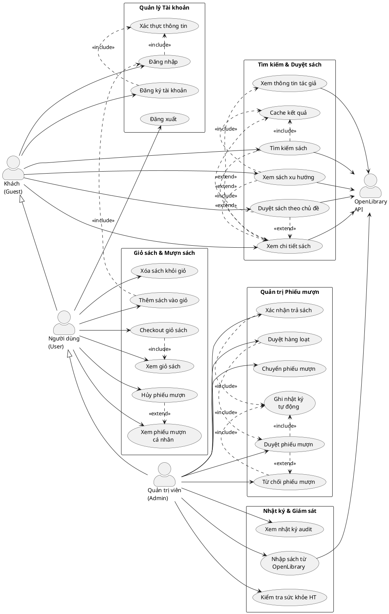

---

## Đề xuất phân chia Module

Dựa trên các use-case đã xác định, hệ thống được chia thành **5 module**:

| STT | Tên module | Phụ trách Use-case | Mô tả ngắn |
|-----|-----------|-------------------|------------|
| 1 | Quản lý Tài khoản | UC01, UC02, UC03 | Đăng ký, đăng nhập, đăng xuất, phân quyền USER/ADMIN |
| 2 | Tìm kiếm & Duyệt sách | UC04, UC05, UC06, UC07, UC08 | Tìm kiếm, duyệt, xem chi tiết sách/tác giả qua OpenLibrary API với caching |
| 3 | Giỏ sách & Mượn sách | UC09, UC10, UC11, UC12, UC13, UC14 | Quản lý giỏ sách Redis, checkout tạo phiếu mượn, xem/hủy phiếu cá nhân |
| 4 | Quản trị Phiếu mượn | UC15, UC16, UC17, UC18, UC19 | Admin duyệt/từ chối/chuyển phiếu, xác nhận trả sách, duyệt hàng loạt |
| 5 | Nhật ký & Giám sát | UC20, UC21, UC22 | Xem audit log, nhập sách từ API, health check |

> **Giai đoạn 1 – Requirements toàn hệ thống đã hoàn thành.**

---

# GIAI ĐOẠN 3 – TRIỂN KHAI TỪNG MODULE

---

# MODULE 1: QUẢN LÝ TÀI KHOẢN

---

## PHA 1: LUỒNG XÁC ĐỊNH YÊU CẦU

### 1. Biểu đồ Use Case chi tiết – Module: Quản lý Tài khoản

**Bước 1:** Copy UC liên quan từ UC tổng quan: UC01 (Đăng ký), UC02 (Đăng nhập), UC03 (Đăng xuất). Actor: Khách, Người dùng, Admin.

**Bước 2:** Xác định giao diện chính → đề xuất UC con:
- Giao diện form đăng ký → UC con: Nhập thông tin đăng ký
- Giao diện form đăng nhập → UC con: Nhập thông tin đăng nhập
- Giao diện chuyển đổi đăng ký/đăng nhập → UC con: Chuyển đổi form

**Bước 3:** Xác định quan hệ:
- UC01 (Đăng ký) `<<include>>` Xác thực thông tin (kiểm tra username trùng)
- UC02 (Đăng nhập) `<<include>>` Xác thực thông tin (kiểm tra username/password)
- UC01 `<<extend>>` UC02 (sau khi đăng ký thành công, có thể chuyển sang đăng nhập)

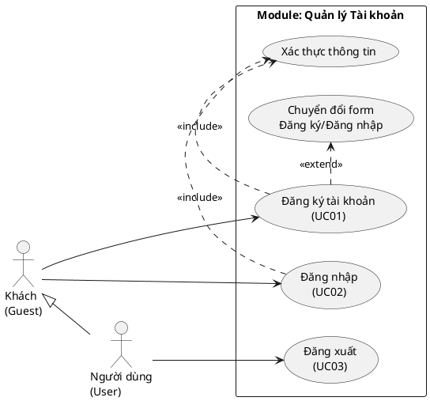

Mô tả các UC của module:
1. **"Đăng ký tài khoản" (UC01):** UC này cho phép Khách tạo tài khoản mới trong hệ thống bằng cách cung cấp username, password và email. Hệ thống kiểm tra tính hợp lệ và tạo tài khoản với vai trò USER mặc định.
2. **"Đăng nhập" (UC02):** UC này cho phép người dùng đã có tài khoản xác thực danh tính bằng username và password để truy cập các chức năng yêu cầu đăng nhập.
3. **"Đăng xuất" (UC03):** UC này cho phép người dùng đã đăng nhập kết thúc phiên làm việc, xóa token và thông tin phiên khỏi trình duyệt.
4. **"Xác thực thông tin":** UC con bắt buộc, kiểm tra username có tồn tại (khi đăng ký) hoặc kiểm tra username/password khớp (khi đăng nhập).
5. **"Chuyển đổi form":** UC mở rộng, cho phép chuyển qua lại giữa form đăng ký và đăng nhập trên cùng một trang.

---

### 2. Kịch bản chuẩn và Ngoại lệ – Module: Quản lý Tài khoản

#### UC01 – Đăng ký tài khoản

| Trường | Nội dung |
|--------|----------|
| **Use case** | Đăng ký tài khoản |
| **Actor** | Khách (Guest) |
| **Tiền điều kiện** | Khách chưa đăng nhập, đang ở trang đăng nhập/đăng ký |
| **Hậu điều kiện** | Tài khoản mới được tạo trong CSDL với vai trò USER, Khách có thể đăng nhập |
| **Kịch bản chính** | 1. Khách truy cập trang đăng nhập của hệ thống.<br>2. Hệ thống hiển thị giao diện "Login" có ô nhập Username, Password và nút "Login", kèm liên kết "Create one" để chuyển sang form đăng ký.<br>3. Khách nhấn liên kết "Create one".<br>4. Hệ thống hiển thị giao diện "Register" có ô nhập Username, Password, Email và nút "Register".<br>5. Khách nhập thông tin: Username = "nguyenvana", Password = "pass123", Email = "nguyenvana@gmail.com".<br>6. Khách nhấn nút "Register".<br>7. Hệ thống kiểm tra username "nguyenvana" chưa tồn tại trong CSDL.<br>8. Hệ thống tạo tài khoản mới với role = "USER" và lưu vào bảng users.<br>9. Hệ thống thông báo "Đăng ký thành công!" và chuyển về form đăng nhập. |
| **Ngoại lệ** | 7. Username "nguyenvana" đã tồn tại trong CSDL.<br>7.1 Hệ thống hiển thị thông báo lỗi "Username already exists".<br>7.2 Khách sửa lại username thành giá trị khác.<br>7.3 Quay lại bước 6. |

#### UC02 – Đăng nhập

| Trường | Nội dung |
|--------|----------|
| **Use case** | Đăng nhập |
| **Actor** | Khách (Guest) |
| **Tiền điều kiện** | Khách đã có tài khoản trong hệ thống, chưa đăng nhập |
| **Hậu điều kiện** | Phiên đăng nhập được tạo, token lưu vào localStorage, chuyển về trang chủ |
| **Kịch bản chính** | 1. Khách truy cập trang đăng nhập.<br>2. Hệ thống hiển thị giao diện "Login" có ô nhập Username, Password và nút "Login".<br>3. Khách nhập Username = "john", Password = "user123".<br>4. Khách nhấn nút "Login".<br>5. Hệ thống gửi thông tin đến API xác thực.<br>6. Hệ thống kiểm tra username "john" tồn tại và password khớp.<br>7. Hệ thống tạo token truy cập, lưu thông tin user và token vào localStorage.<br>8. Hệ thống chuyển hướng về trang chủ, thanh điều hướng hiển thị tên người dùng "john". |
| **Ngoại lệ** | 6. Username không tồn tại hoặc password không khớp.<br>6.1 Hệ thống hiển thị thông báo lỗi "Invalid credentials".<br>6.2 Khách kiểm tra lại thông tin và nhập lại.<br>6.3 Quay lại bước 4. |

#### UC03 – Đăng xuất

| Trường | Nội dung |
|--------|----------|
| **Use case** | Đăng xuất |
| **Actor** | Người dùng (User) / Quản trị viên (Admin) |
| **Tiền điều kiện** | Người dùng đã đăng nhập thành công |
| **Hậu điều kiện** | Token và thông tin user bị xóa khỏi localStorage, chuyển về trạng thái Khách |
| **Kịch bản chính** | 1. Người dùng nhấn vào tên tài khoản trên thanh điều hướng.<br>2. Hệ thống hiển thị menu dropdown có mục "Logout".<br>3. Người dùng nhấn "Logout".<br>4. Hệ thống xóa token và thông tin user khỏi localStorage.<br>5. Hệ thống chuyển hướng về trang chủ, thanh điều hướng hiển thị nút "Login". |
| **Ngoại lệ** | Không có ngoại lệ. |

---

## PHA 2: LUỒNG PHÂN TÍCH

### 3. Biểu đồ thực thể pha phân tích – Module: Quản lý Tài khoản

**Bước 1 – Mô tả chức năng bằng văn xuôi:**

Module Quản lý Tài khoản cho phép khách đăng ký tài khoản mới bằng cách cung cấp tên đăng nhập, mật khẩu và email. Hệ thống kiểm tra tên đăng nhập chưa tồn tại rồi lưu thông tin người dùng vào cơ sở dữ liệu với vai trò mặc định là USER. Khi đăng nhập, người dùng cung cấp tên đăng nhập và mật khẩu, hệ thống xác thực thông tin và tạo token truy cập. Token được lưu ở trình duyệt và dùng để xác định phiên đăng nhập. Khi đăng xuất, hệ thống hủy token và xóa thông tin phiên khỏi trình duyệt.

**Bước 2 + 3 – Trích danh từ và đánh giá:**

- ▪ Khách → loại: là Actor, không phải Entity
- ▪ Hệ thống → loại: quá chung
- ▪ Tài khoản → giữ lại, nhưng gộp vào lớp NguoiDung (tài khoản = thông tin người dùng)
- ▪ Tên đăng nhập (username) → thuộc tính của NguoiDung
- ▪ Mật khẩu (password) → thuộc tính của NguoiDung
- ▪ Email → thuộc tính của NguoiDung
- ▪ Vai trò (role) → thuộc tính của NguoiDung
- ▪ Người dùng → lớp **NguoiDung**: id, username, password, role, email, ngayTao
- ▪ Cơ sở dữ liệu → loại: là hạ tầng, không phải Entity
- ▪ Token → loại: là dữ liệu tạm thời trên client, không lưu CSDL
- ▪ Trình duyệt → loại: là hạ tầng bên ngoài
- ▪ Phiên đăng nhập → loại: dữ liệu tạm thời (in-memory), không phải Entity

**Bước 4 – Xác định quan hệ:**

Module này chỉ có 1 lớp Entity chính (NguoiDung). Không có quan hệ giữa các thực thể trong phạm vi module. Quan hệ với các module khác (PhieuMuon, NhatKy) sẽ được thể hiện ở module tương ứng.

**Bước 5 – Bổ sung quan hệ:** Không có quan hệ bổ sung.

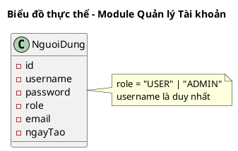

---

### 4. Biểu đồ lớp đầy đủ pha phân tích (BCE) – Module: Quản lý Tài khoản

**Bước 1 – Xác định lớp Boundary:**

1. Giao diện Đăng nhập → lớp **GDDangNhap**
   - Phương thức: dangNhap()
   - Input: username, password
   - Output: thông báo thành công/thất bại
   - Lớp chủ thể: NguoiDung

2. Giao diện Đăng ký → lớp **GDDangKy**
   - Phương thức: dangKy()
   - Input: username, password, email
   - Output: thông báo thành công/thất bại
   - Lớp chủ thể: NguoiDung

3. Giao diện Thanh điều hướng → lớp **GDThanhDieuHuong**
   - Phương thức: dangXuat()
   - Input: (không có)
   - Output: chuyển về trạng thái Khách
   - Lớp chủ thể: NguoiDung

**Bước 2 – Xác định phương thức:**

Mỗi thao tác vào/ra dữ liệu → 1 phương thức:
- GDDangKy: nhập thông tin → `dangKy()`
- GDDangNhap: nhập thông tin → `dangNhap()`
- GDThanhDieuHuong: nhấn logout → `dangXuat()`
- NguoiDung: tìm user → `timTheoUsername()`, tạo user → `taoNguoiDung()`, kiểm tra mật khẩu → `xacThucMatKhau()`

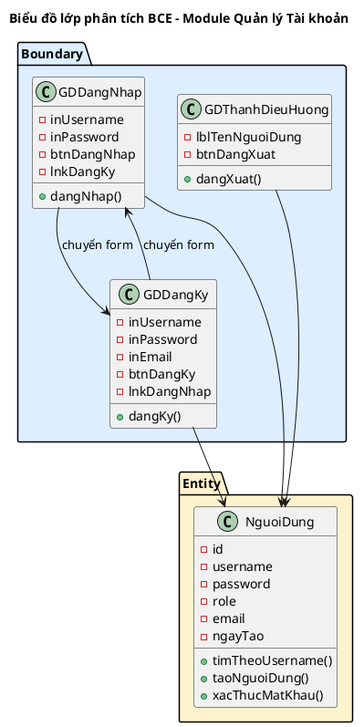

---

### 5. Biểu đồ tuần tự pha phân tích – Module: Quản lý Tài khoản

#### UC01 – Đăng ký tài khoản (Tuần tự Phân tích)

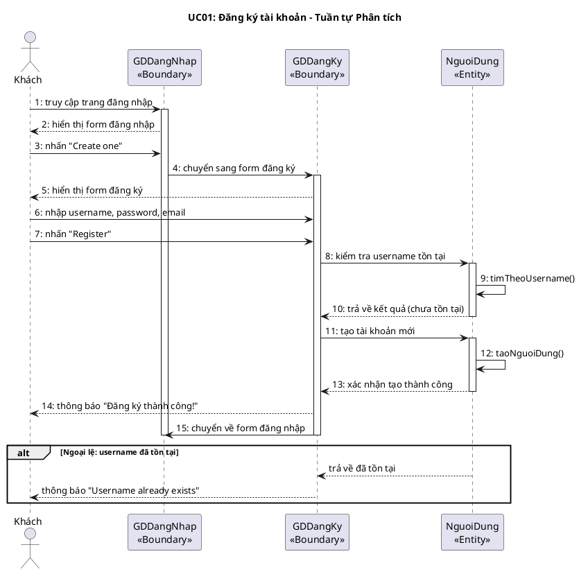

#### UC02 – Đăng nhập (Tuần tự Phân tích)

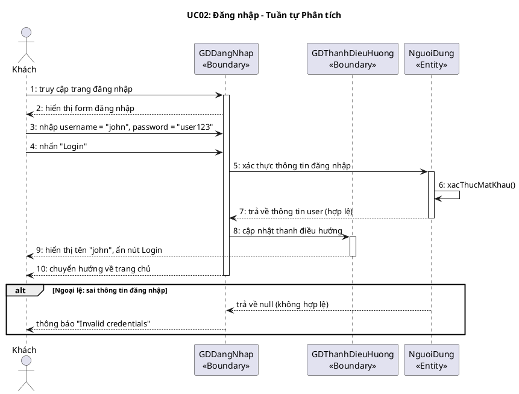

#### UC03 – Đăng xuất (Tuần tự Phân tích)

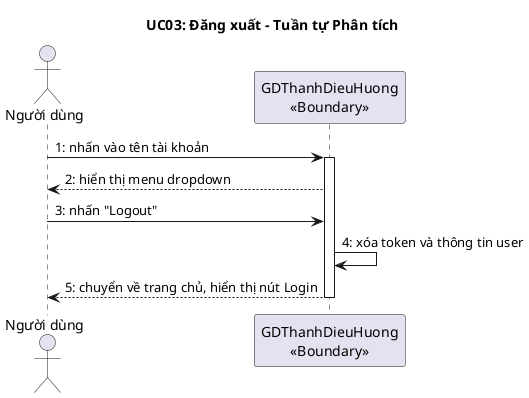

---

## PHA 3: LUỒNG THIẾT KẾ

### 6. Biểu đồ thiết kế lớp thực thể – Module: Quản lý Tài khoản

**Bước 1:** Bổ sung thuộc tính `id` (kiểu `int`) → NguoiDung đã có `id`.

**Bước 2:** Bổ sung kiểu dữ liệu Python:

**Bước 3:** Module này chỉ có 1 lớp Entity, không cần chuyển đổi quan hệ.

**Bước 4:** Không có thuộc tính kiểu đối tượng (module đơn giản).

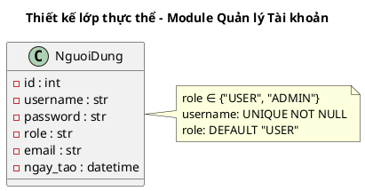

---

### 7. Biểu đồ thiết kế CSDL (ERD) – Module: Quản lý Tài khoản

**Bước 1:** Lớp NguoiDung → bảng `tblNguoiDung`

**Bước 2:** Chuyển đổi kiểu dữ liệu sang SQL:
- `str` → `VARCHAR(255)`
- `int` → `INTEGER`
- `datetime` → `TIMESTAMP`

**Bước 3:** Module này chỉ có 1 bảng, quan hệ với bảng khác sẽ ở module tương ứng.

**Bước 4:** Khóa chính: `id` là PK. Chưa có FK trong module này.

**Bước 5:** Loại bỏ dư thừa: không có thuộc tính dẫn xuất hay trùng lặp.

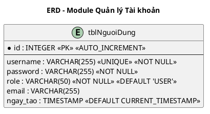

---

### 8. Thiết kế giao diện & Biểu đồ lớp thiết kế – Module: Quản lý Tài khoản

#### 8.1 Wireframe ASCII

**Màn hình Đăng nhập:**
```
┌──────────────────────────────────────────┐
│              📚 Library Login            │
│                                          │
│  Username:  [________________________]   │
│  Password:  [________________________]   │
│                                          │
│              [ Login ]                   │
│                                          │
│  Don't have an account? Create one       │
└──────────────────────────────────────────┘
```

**Màn hình Đăng ký:**
```
┌──────────────────────────────────────────┐
│            📚 Create Account             │
│                                          │
│  Username:  [________________________]   │
│  Password:  [________________________]   │
│  Email:     [________________________]   │
│                                          │
│              [ Register ]                │
│                                          │
│  Already have an account? Login          │
└──────────────────────────────────────────┘
```

**Thanh điều hướng (đã đăng nhập):**
```
┌──────────────────────────────────────────────────────┐
│  📚 Library   [Home] [Search]  🛒Cart   ▼ john      │
│                                         ├──────────┤ │
│                                         │ My Loans │ │
│                                         │ Admin    │ │
│                                         │ Logout   │ │
│                                         └──────────┘ │
└──────────────────────────────────────────────────────┘
```

#### 8.2 Biểu đồ lớp thiết kế chi tiết

**Xác định chữ ký hàm DAO:**

1. Tìm người dùng theo username => `get_user_by_username()`
   - Input: username (str)
   - Output: dict hoặc None
   - Chọn: `get_user_by_username(username: str) -> Optional[dict]`

2. Tạo người dùng mới => `create_user()`
   - Input: username, password, email, role
   - Output: id của user mới (int)
   - Chọn: `create_user(username: str, password: str, email: str, role: str) -> int`

3. Xác thực mật khẩu => `verify_password()`
   - Input: username, password
   - Output: dict (thông tin user) hoặc None
   - Chọn: `verify_password(username: str, password: str) -> Optional[dict]`

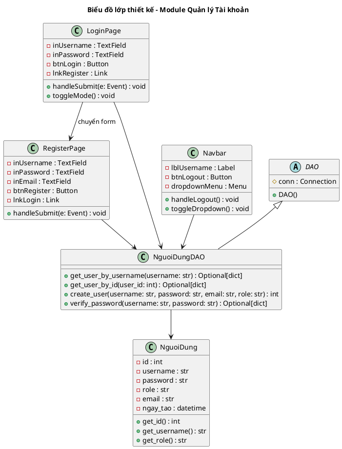

---

### 9. Biểu đồ tuần tự pha thiết kế – Module: Quản lý Tài khoản

#### UC01 – Đăng ký tài khoản (Tuần tự Thiết kế)

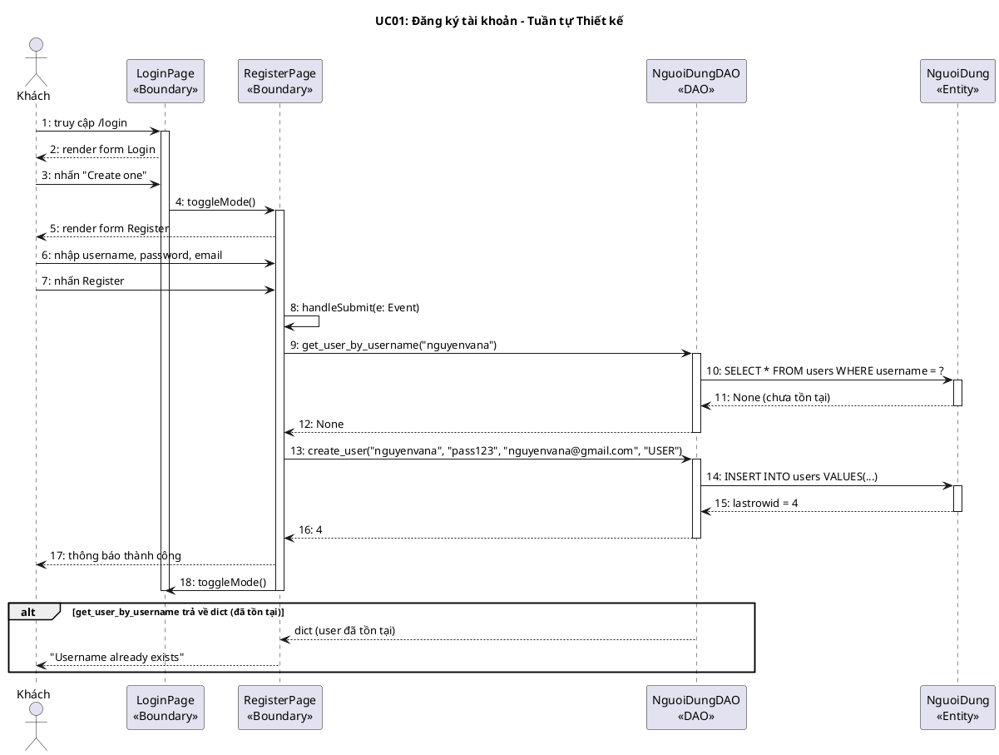

#### UC02 – Đăng nhập (Tuần tự Thiết kế)

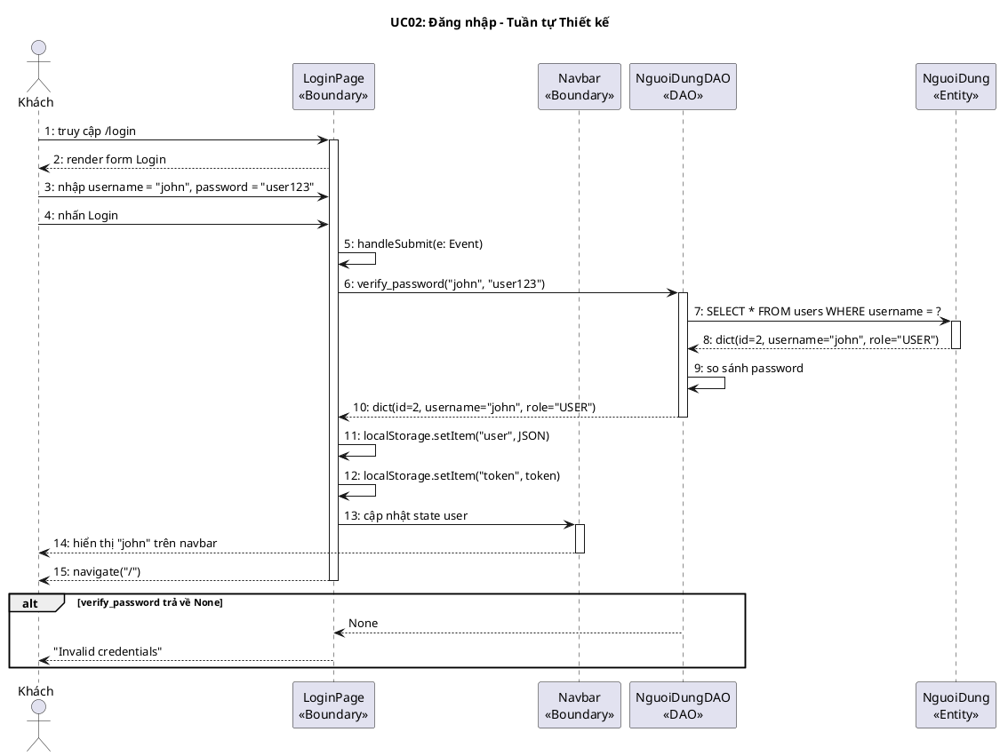

---

## PHA 4: LUỒNG KIỂM THỬ

### 10. Test Plan & Test Case – Module: Quản lý Tài khoản

#### 10a. Bảng Test Case

| TT | Module | Test case |
|----|--------|-----------|
| 1 | Quản lý Tài khoản | Đăng ký thành công với username, password, email hợp lệ |
| 2 | Quản lý Tài khoản | Đăng ký thất bại khi username đã tồn tại |
| 3 | Quản lý Tài khoản | Đăng nhập thành công với thông tin đúng |
| 4 | Quản lý Tài khoản | Đăng nhập thất bại khi username không tồn tại |
| 5 | Quản lý Tài khoản | Đăng nhập thất bại khi password sai |
| 6 | Quản lý Tài khoản | Đăng xuất thành công, xóa token khỏi localStorage |

#### 10b. Trạng thái CSDL trước khi test

```
tblNguoiDung
| id | username | password | role  | email              | ngay_tao            |
|----|----------|----------|-------|--------------------|---------------------|
| 1  | admin    | admin123 | ADMIN | admin@library.com  | 2026-05-01 00:00:00 |
| 2  | john     | user123  | USER  | john@example.com   | 2026-05-01 00:00:00 |
| 3  | jane     | user123  | USER  | jane@example.com   | 2026-05-01 00:00:00 |
```

#### 10c. Kịch bản thực hiện + Kết quả mong đợi

**TC1 – Đăng ký thành công:**

| Kịch bản | Kết quả mong đợi |
|----------|-----------------|
| 1. Khách truy cập trang /login | Hiển thị form Login với ô Username, Password, nút Login |
| 2. Khách nhấn "Create one" | Chuyển sang form Register với ô Username, Password, Email |
| 3. Nhập Username = "nguyenvana", Password = "pass123", Email = "nguyenvana@gmail.com" | Các ô nhập liệu hiển thị giá trị đã nhập |
| 4. Nhấn "Register" | Hệ thống gửi POST /api/auth/register |
| 5. Hệ thống xử lý | Trả về HTTP 201, body: {"id": 4, "username": "nguyenvana"} |
| 6. Giao diện cập nhật | Thông báo "Đăng ký thành công!", chuyển về form Login |

**TC2 – Đăng ký thất bại (username trùng):**

| Kịch bản | Kết quả mong đợi |
|----------|-----------------|
| 1. Khách truy cập form Register | Hiển thị form Register |
| 2. Nhập Username = "john", Password = "abc123", Email = "new@test.com" | Các ô hiển thị giá trị |
| 3. Nhấn "Register" | Hệ thống gửi POST /api/auth/register |
| 4. Hệ thống xử lý | Trả về HTTP 400, body: {"detail": "Username already exists"} |
| 5. Giao diện cập nhật | Hiển thị thông báo lỗi "Username already exists" |

**TC3 – Đăng nhập thành công:**

| Kịch bản | Kết quả mong đợi |
|----------|-----------------|
| 1. Khách truy cập trang /login | Hiển thị form Login |
| 2. Nhập Username = "john", Password = "user123" | Các ô hiển thị giá trị |
| 3. Nhấn "Login" | Hệ thống gửi POST /api/auth/login |
| 4. Hệ thống xử lý | Trả về HTTP 200, body: {"access_token": "token_2_...", "user": {"id": 2, "username": "john", "role": "USER"}} |
| 5. Giao diện cập nhật | Chuyển về trang chủ, navbar hiển thị "john", localStorage chứa token |

**TC4 – Đăng nhập thất bại (sai password):**

| Kịch bản | Kết quả mong đợi |
|----------|-----------------|
| 1. Nhập Username = "john", Password = "wrongpass" | Các ô hiển thị giá trị |
| 2. Nhấn "Login" | Trả về HTTP 401, {"detail": "Invalid credentials"} |
| 3. Giao diện cập nhật | Hiển thị "Invalid credentials", giữ nguyên form |

#### 10d. Trạng thái CSDL sau khi test (sau TC1)

```
tblNguoiDung (sau test TC1)
| id | username   | password | role  | email                  | ngay_tao            |
|----|------------|----------|-------|------------------------|---------------------|
| 1  | admin      | admin123 | ADMIN | admin@library.com      | 2026-05-01 00:00:00 |
| 2  | john       | user123  | USER  | john@example.com       | 2026-05-01 00:00:00 |
| 3  | jane       | user123  | USER  | jane@example.com       | 2026-05-01 00:00:00 |
| 4  | nguyenvana | pass123  | USER  | nguyenvana@gmail.com   | 2026-05-06 00:30:00 | ← hàng mới
```

> **Module 1 – Quản lý Tài khoản: Hoàn thành tất cả 4 pha (10 mục).**

---

# MODULE 2: TÌM KIẾM & DUYỆT SÁCH

---

## PHA 1: LUỒNG XÁC ĐỊNH YÊU CẦU

### 1. Biểu đồ Use Case chi tiết – Module: Tìm kiếm & Duyệt sách

**Bước 1:** UC liên quan: UC04 (Tìm kiếm sách), UC05 (Xem sách xu hướng), UC06 (Duyệt theo chủ đề), UC07 (Xem chi tiết sách), UC08 (Xem thông tin tác giả). Actor: Khách, Người dùng, Admin, OpenLibrary API.

**Bước 2:** Giao diện → UC con:
- Trang chủ hiển thị trending → UC con: Hiển thị sách xu hướng
- Trang kết quả tìm kiếm → UC con: Hiển thị kết quả phân trang
- Trang chi tiết sách → UC con: Hiển thị chi tiết

**Bước 3:** Quan hệ:
- UC04, UC05, UC06 `<<include>>` Cache kết quả (luôn kiểm tra cache trước)
- UC04, UC05, UC06 `<<extend>>` UC07 (nhấn vào sách để xem chi tiết)
- UC07 `<<extend>>` UC08 (từ chi tiết sách có thể xem tác giả)

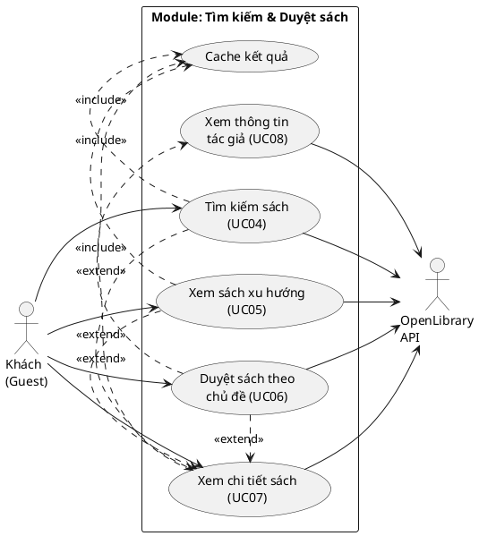

Mô tả các UC:
1. **"Tìm kiếm sách" (UC04):** Cho phép người dùng nhập từ khóa để tìm sách qua OpenLibrary API, kết quả hiển thị dạng danh sách có phân trang.
2. **"Xem sách xu hướng" (UC05):** Hiển thị danh sách sách trending trên trang chủ, dữ liệu từ OpenLibrary trending API.
3. **"Duyệt sách theo chủ đề" (UC06):** Cho phép xem sách theo nhóm chủ đề (Science, History, Fiction...).
4. **"Xem chi tiết sách" (UC07):** Hiển thị thông tin đầy đủ: bìa, mô tả, tác giả, chủ đề, năm xuất bản.
5. **"Xem thông tin tác giả" (UC08):** Hiển thị tiểu sử, ảnh, ngày sinh, liên kết Wikipedia của tác giả.
6. **"Cache kết quả":** UC con bắt buộc, kiểm tra Redis cache trước khi gọi API bên ngoài.

---

### 2. Kịch bản chuẩn và Ngoại lệ – Module: Tìm kiếm & Duyệt sách

#### UC04 – Tìm kiếm sách

| Trường | Nội dung |
|--------|----------|
| **Use case** | Tìm kiếm sách |
| **Actor** | Khách / Người dùng / Admin |
| **Tiền điều kiện** | Actor đang ở bất kỳ trang nào có thanh tìm kiếm |
| **Hậu điều kiện** | Danh sách sách phù hợp được hiển thị, kết quả được cache |
| **Kịch bản chính** | 1. Actor nhập từ khóa "python" vào thanh tìm kiếm trên navbar.<br>2. Actor nhấn Enter hoặc nút tìm kiếm.<br>3. Hệ thống chuyển hướng đến trang /search?q=python.<br>4. Hệ thống kiểm tra Redis cache với key "search:python:20:1".<br>5. Cache không có → Hệ thống gửi request tới OpenLibrary API: GET /search.json?q=python&limit=20&page=1.<br>6. OpenLibrary API trả về kết quả.<br>7. Hệ thống lưu kết quả vào Redis cache (TTL = 10 phút).<br>8. Hệ thống hiển thị danh sách sách:<br><table><tr><th>Bìa</th><th>Tiêu đề</th><th>Tác giả</th><th>Năm XB</th></tr><tr><td>📖</td><td>Learning Python</td><td>Mark Lutz</td><td>2013</td></tr><tr><td>📖</td><td>Python Crash Course</td><td>Eric Matthes</td><td>2015</td></tr><tr><td>📖</td><td>Fluent Python</td><td>Luciano Ramalho</td><td>2015</td></tr></table><br>9. Hiển thị phân trang: "Showing 1-20 of 1500 results", nút Previous/Next. |
| **Ngoại lệ** | 5. Cache có kết quả → Hệ thống trả về dữ liệu cache, bỏ qua bước 5-7.<br><br>6. OpenLibrary API timeout hoặc lỗi.<br>6.1 Hệ thống trả về danh sách rỗng.<br>6.2 Hiển thị thông báo "No results found".<br><br>8. Không có sách phù hợp từ khóa.<br>8.1 Hiển thị "No results found for 'xyz'". |

#### UC07 – Xem chi tiết sách

| Trường | Nội dung |
|--------|----------|
| **Use case** | Xem chi tiết sách |
| **Actor** | Khách / Người dùng / Admin |
| **Tiền điều kiện** | Actor đang xem danh sách sách (từ tìm kiếm, trending, hoặc chủ đề) |
| **Hậu điều kiện** | Thông tin chi tiết sách được hiển thị |
| **Kịch bản chính** | 1. Actor nhấn vào tiêu đề hoặc bìa sách "Learning Python" từ danh sách kết quả.<br>2. Hệ thống chuyển hướng đến trang /works/OL123456W.<br>3. Hệ thống kiểm tra Redis cache với key "work:/works/OL123456W".<br>4. Cache không có → gửi GET tới OpenLibrary API.<br>5. Hệ thống hiển thị thông tin chi tiết:<br>▪ Bìa sách lớn<br>▪ Tiêu đề: "Learning Python"<br>▪ Tác giả: "Mark Lutz"<br>▪ Mô tả: "An introduction to Python..."<br>▪ Chủ đề: "Python, Programming, Computer Science"<br>▪ Năm xuất bản: 2013<br>6. Nếu Actor đã đăng nhập → hiển thị nút "Add to Cart". |
| **Ngoại lệ** | 4. Sách không tồn tại trên OpenLibrary.<br>4.1 API trả về 404.<br>4.2 Hệ thống hiển thị "Work not found". |

---

## PHA 2: LUỒNG PHÂN TÍCH

### 3. Biểu đồ thực thể pha phân tích – Module: Tìm kiếm & Duyệt sách

**Bước 1 – Mô tả chức năng:**

Module Tìm kiếm & Duyệt sách cho phép người dùng tìm kiếm sách bằng từ khóa, xem sách xu hướng và duyệt sách theo chủ đề. Hệ thống gửi yêu cầu tới OpenLibrary API để lấy dữ liệu sách bao gồm tiêu đề, tác giả, bìa sách, mô tả, năm xuất bản và chủ đề. Kết quả được lưu vào bộ nhớ đệm Redis với thời gian sống nhất định. Người dùng có thể nhấn vào sách để xem chi tiết và xem thông tin tác giả.

**Bước 2 + 3 – Trích danh từ:**

- ▪ Sách → lớp **Sach**: tieuDe, tacGia, biaUrl, moTa, namXuatBan, chuDe, isbn, openlibraryKey
- ▪ Tác giả → lớp **TacGia**: ten, tieuSu, ngaySinh, anhUrl, wikipedia
- ▪ Chủ đề → thuộc tính của Sach (danh sách chuỗi, không cần lớp riêng)
- ▪ Kết quả tìm kiếm → loại: là tập hợp Sach, không phải Entity riêng
- ▪ Bộ nhớ đệm (Cache) → loại: là hạ tầng kỹ thuật
- ▪ Từ khóa → loại: là tham số đầu vào

**Bước 4 – Quan hệ:**
- ▪ 1 Sach có thể có nhiều TacGia và ngược lại → Sach – TacGia: n – n
- ▪ Trong phạm vi module này, quan hệ n-n được xử lý đơn giản qua danh sách (không cần bảng trung gian vì dữ liệu đến từ API bên ngoài)

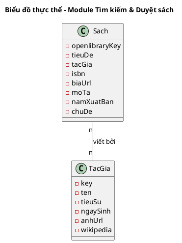

---

### 4. Biểu đồ lớp BCE – Module: Tìm kiếm & Duyệt sách

**Bước 1 – Lớp Boundary:**

1. Trang chủ → **GDTrangChu**: hiển thị trending, chủ đề
2. Trang tìm kiếm → **GDTimKiem**: hiển thị kết quả, phân trang
3. Trang chi tiết sách → **GDChiTietSach**: hiển thị thông tin đầy đủ
4. Thanh điều hướng → **GDThanhTimKiem**: ô nhập từ khóa

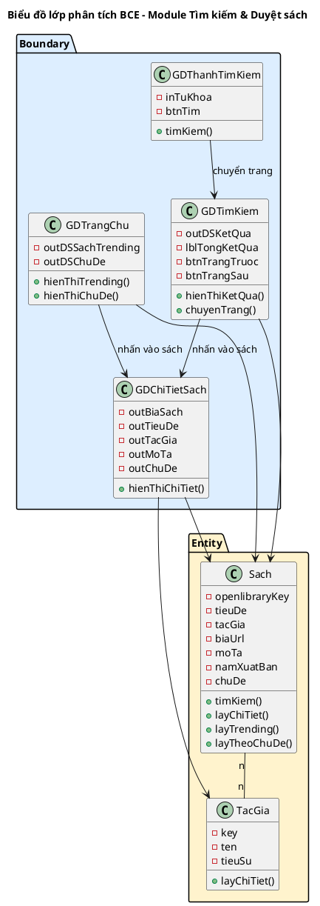

---

### 5. Biểu đồ tuần tự pha phân tích – Module: Tìm kiếm & Duyệt sách

#### UC04 – Tìm kiếm sách (Tuần tự Phân tích)

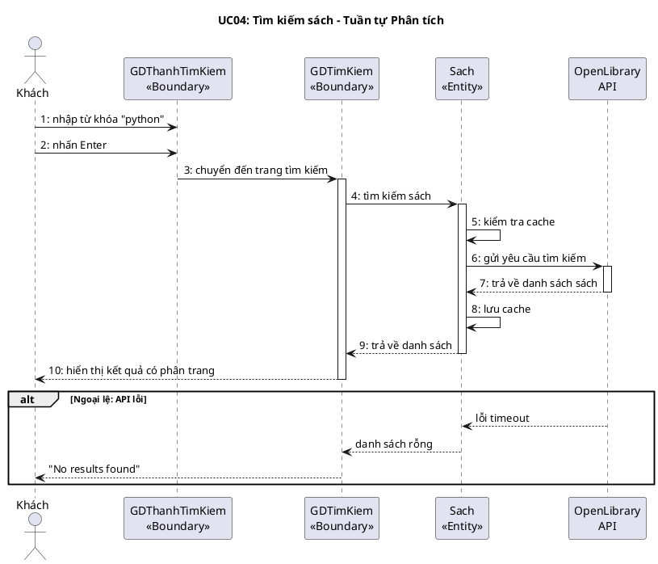

#### UC07 – Xem chi tiết sách (Tuần tự Phân tích)

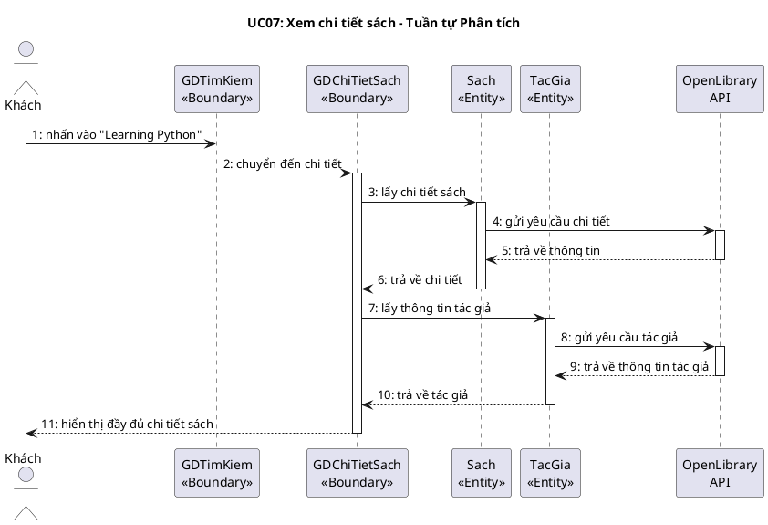

---

## PHA 3: LUỒNG THIẾT KẾ

### 6. Biểu đồ thiết kế lớp thực thể – Module: Tìm kiếm & Duyệt sách

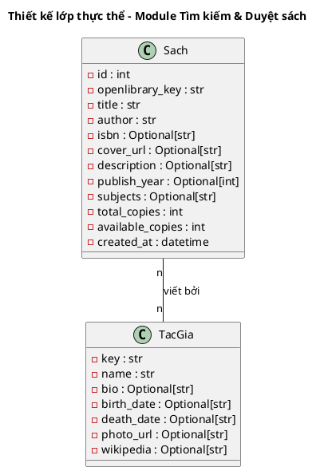

---

### 7. ERD – Module: Tìm kiếm & Duyệt sách

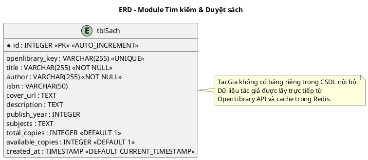

---

### 8. Wireframe & Lớp thiết kế – Module: Tìm kiếm & Duyệt sách

#### 8.1 Wireframe

**Trang tìm kiếm:**
```
┌──────────────────────────────────────────┐
│  🔍 Search: [___python___] [Search]      │
│                                          │
│  Results for "python" (1500 found)       │
│ ┌──────┬──────────────┬──────────┬─────┐ │
│ │ Bìa  │ Tiêu đề      │ Tác giả  │ Năm │ │
│ │ 📖   │ Learning Py..│ M. Lutz  │2013 │ │
│ │ 📖   │ Python Cras..│ E. Matt..│2015 │ │
│ │ 📖   │ Fluent Pyth..│ L. Rama..│2015 │ │
│ └──────┴──────────────┴──────────┴─────┘ │
│  [◀ Prev]  Page 1 of 75  [Next ▶]       │
└──────────────────────────────────────────┘
```

**Trang chi tiết sách:**
```
┌──────────────────────────────────────────┐
│  ┌────────┐  Learning Python             │
│  │  BÌA   │  by Mark Lutz                │
│  │  SÁCH  │  Published: 2013             │
│  │        │                              │
│  └────────┘  Subjects: Python, Prog...   │
│                                          │
│  Description:                            │
│  An introduction to Python programming.. │
│                                          │
│  [ Add to Cart ]                         │
└──────────────────────────────────────────┘
```

#### 8.2 Biểu đồ lớp thiết kế

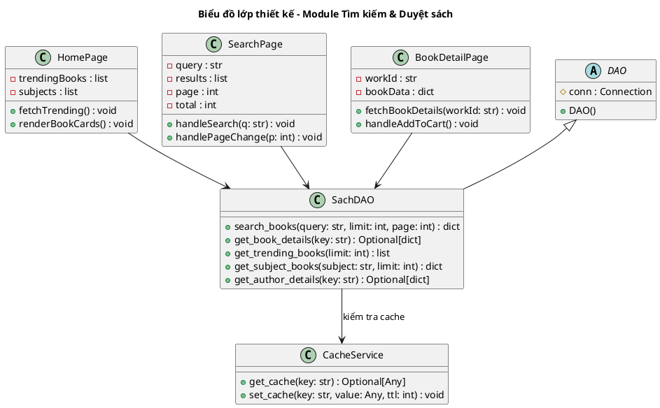

---

### 9. Biểu đồ tuần tự thiết kế – Module: Tìm kiếm & Duyệt sách

#### UC04 – Tìm kiếm sách (Tuần tự Thiết kế)

```plantuml
@startuml
title UC04: Tìm kiếm sách – Tuần tự Thiết kế

actor "Khách" as Actor
participant "SearchPage\n<<Boundary>>" as B
participant "CacheService\n<<Service>>" as Cache
participant "SachDAO\n<<DAO>>" as DAO
participant "OpenLibrary\nAPI" as OL

Actor -> B : 1: nhập "python" + nhấn Enter
B -> B : 2: handleSearch("python")
B -> DAO : 3: search_books("python", 20, 1)
activate DAO
DAO -> Cache : 4: get_cache("search:python:20:1")
activate Cache
Cache --> DAO : 5: None (cache miss)
deactivate Cache
DAO -> OL : 6: GET /search.json?q=python&limit=20&page=1
activate OL
OL --> DAO : 7: JSON response
deactivate OL
DAO -> Cache : 8: set_cache("search:python:20:1", result, 600)
DAO --> B : 9: {books: [...], total: 1500}
deactivate DAO
B --> Actor : 10: render danh sách + phân trang

alt Cache hit
  Cache --> DAO : cached result
  DAO --> B : cached data (bỏ qua bước 6-8)
end
@enduml
```

---

## PHA 4: LUỒNG KIỂM THỬ

### 10. Test Plan & Test Case – Module: Tìm kiếm & Duyệt sách

#### 10a. Bảng Test Case

| TT | Module | Test case |
|----|--------|-----------|
| 1 | Tìm kiếm & Duyệt sách | Tìm kiếm sách thành công với từ khóa hợp lệ |
| 2 | Tìm kiếm & Duyệt sách | Tìm kiếm không có kết quả |
| 3 | Tìm kiếm & Duyệt sách | Kết quả cache được trả về khi tìm kiếm lần 2 |
| 4 | Tìm kiếm & Duyệt sách | Xem chi tiết sách thành công |
| 5 | Tìm kiếm & Duyệt sách | Xem sách trending trên trang chủ |
| 6 | Tìm kiếm & Duyệt sách | Duyệt sách theo chủ đề "science_fiction" |

#### 10b. CSDL trước test

Module này chủ yếu lấy dữ liệu từ OpenLibrary API nên CSDL nội bộ không thay đổi. Cache Redis trống trước test.

#### 10c. Kịch bản TC1 – Tìm kiếm thành công

| Kịch bản | Kết quả mong đợi |
|----------|-----------------|
| 1. Nhập "python" vào thanh tìm kiếm | Ô nhập hiển thị "python" |
| 2. Nhấn Enter | Chuyển đến /search?q=python |
| 3. Hệ thống xử lý | Gửi GET /api/search?q=python&limit=20&page=1, trả về HTTP 200 |
| 4. Hiển thị kết quả | Danh sách ~20 sách với bìa, tiêu đề, tác giả, năm. Phân trang hiển thị. |

> **Module 2 – Tìm kiếm & Duyệt sách: Hoàn thành tất cả 4 pha.**

---

# MODULE 3: GIỎ SÁCH & MƯỢN SÁCH

---

## PHA 1: LUỒNG XÁC ĐỊNH YÊU CẦU

### 1. Biểu đồ Use Case chi tiết – Module: Giỏ sách & Mượn sách

```plantuml
@startuml
left to right direction
skinparam packageStyle rectangle

actor "Người dùng\n(User)" as User

package "Module: Giỏ sách & Mượn sách" {
  usecase "Thêm sách vào giỏ\n(UC09)" as UC09
  usecase "Xóa sách khỏi giỏ\n(UC10)" as UC10
  usecase "Xem giỏ sách\n(UC11)" as UC11
  usecase "Checkout giỏ sách\n(UC12)" as UC12
  usecase "Xem phiếu mượn\ncá nhân (UC13)" as UC13
  usecase "Hủy phiếu mượn\n(UC14)" as UC14
  usecase "Kiểm tra đăng nhập" as UC_login
  usecase "Kiểm tra giới hạn\n5 phiếu" as UC_limit

  UC09 .> UC_login : <<include>>
  UC12 .> UC11 : <<include>>
  UC12 .> UC_limit : <<include>>
  UC14 .> UC13 : <<extend>>
}

User --> UC09
User --> UC10
User --> UC11
User --> UC12
User --> UC13
User --> UC14
@enduml
```

Mô tả các UC:
1. **"Thêm sách vào giỏ" (UC09):** Cho phép User thêm sách vào giỏ mượn (Redis), không trùng lặp. Yêu cầu đăng nhập.
2. **"Xóa sách khỏi giỏ" (UC10):** Cho phép User xóa sách khỏi giỏ.
3. **"Xem giỏ sách" (UC11):** Hiển thị danh sách sách trong giỏ.
4. **"Checkout giỏ sách" (UC12):** Tạo phiếu mượn PENDING cho tất cả sách trong giỏ, xóa giỏ. Include kiểm tra giới hạn 5 phiếu.
5. **"Xem phiếu mượn cá nhân" (UC13):** Xem danh sách phiếu mượn, lọc theo trạng thái.
6. **"Hủy phiếu mượn" (UC14):** Hủy phiếu PENDING hoặc APPROVED, hoàn bản sao nếu cần.

---

### 2. Kịch bản chuẩn và Ngoại lệ – Module: Giỏ sách & Mượn sách

#### UC12 – Checkout giỏ sách

| Trường | Nội dung |
|--------|----------|
| **Use case** | Checkout giỏ sách |
| **Actor** | Người dùng (User) |
| **Tiền điều kiện** | User đã đăng nhập, giỏ sách có ít nhất 1 cuốn sách |
| **Hậu điều kiện** | Phiếu mượn PENDING được tạo cho mỗi sách, giỏ sách được xóa |
| **Kịch bản chính** | 1. Người dùng "john" (id=2) nhấn vào biểu tượng 🛒 Cart trên navbar.<br>2. Hệ thống hiển thị trang "My Cart" với danh sách sách trong giỏ:<br><table><tr><th>Bìa</th><th>Tiêu đề</th><th>Tác giả</th><th>Thao tác</th></tr><tr><td>📖</td><td>Learning Python</td><td>Mark Lutz</td><td>[Remove]</td></tr><tr><td>📖</td><td>Clean Code</td><td>Robert Martin</td><td>[Remove]</td></tr></table><br>3. Người dùng nhấn nút "Checkout (2 books)".<br>4. Hệ thống kiểm tra giỏ không rỗng (2 sách).<br>5. Hệ thống tạo phiếu mượn PENDING cho "Learning Python" (loan_id = 1).<br>6. Hệ thống tạo phiếu mượn PENDING cho "Clean Code" (loan_id = 2).<br>7. Hệ thống xóa toàn bộ giỏ sách của user_id=2 trên Redis.<br>8. Hệ thống thông báo "Checkout successful! 2 loan requests created." |
| **Ngoại lệ** | 4. Giỏ sách rỗng.<br>4.1 Hệ thống hiển thị "Cart is empty".<br>4.2 Không tạo phiếu mượn.<br><br>5. User đã có 5 phiếu mượn active (trigger check_max_loans).<br>5.1 Hệ thống báo lỗi "User has reached maximum active loans (5)".<br>5.2 Phiếu mượn không được tạo cho sách đó, các sách khác vẫn tiếp tục. |

#### UC14 – Hủy phiếu mượn

| Trường | Nội dung |
|--------|----------|
| **Use case** | Hủy phiếu mượn |
| **Actor** | Người dùng (User) |
| **Tiền điều kiện** | User đã đăng nhập, có phiếu mượn ở trạng thái PENDING hoặc APPROVED |
| **Hậu điều kiện** | Phiếu chuyển sang CANCELLED; nếu đã APPROVED thì hoàn bản sao |
| **Kịch bản chính** | 1. Người dùng truy cập trang "My Loans".<br>2. Hệ thống hiển thị danh sách phiếu mượn:<br><table><tr><th>Sách</th><th>Trạng thái</th><th>Ngày yêu cầu</th><th>Thao tác</th></tr><tr><td>Learning Python</td><td>PENDING</td><td>2026-05-06</td><td>[Cancel]</td></tr><tr><td>Clean Code</td><td>APPROVED</td><td>2026-05-05</td><td>[Cancel]</td></tr></table><br>3. Người dùng nhấn "Cancel" cho phiếu "Learning Python" (PENDING).<br>4. Hệ thống chuyển trạng thái sang CANCELLED.<br>5. Trigger ghi audit log.<br>6. Hệ thống cập nhật danh sách, phiếu hiển thị trạng thái CANCELLED. |
| **Ngoại lệ** | 3. Phiếu ở trạng thái RETURNED hoặc CANCELLED → nút Cancel không hiển thị. |

---

## PHA 2: LUỒNG PHÂN TÍCH

### 3. Biểu đồ thực thể pha phân tích – Module: Giỏ sách & Mượn sách

**Bước 1 – Mô tả chức năng:**

Module Giỏ sách & Mượn sách cho phép người dùng thêm sách vào giỏ mượn, xem giỏ, xóa sách khỏi giỏ, và checkout để tạo phiếu mượn. Giỏ sách lưu trên Redis. Khi checkout, hệ thống tạo phiếu mượn ở trạng thái chờ duyệt cho mỗi sách trong giỏ. Người dùng có thể xem danh sách phiếu mượn cá nhân và hủy phiếu nếu cần.

**Bước 2 + 3 – Trích danh từ:**

- ▪ Giỏ sách → **GioSach**: danh sách các book_id, thuộc về user_id (lưu Redis, không lưu CSDL)
- ▪ Phiếu mượn → lớp **PhieuMuon**: id, userId, sachId, ngayYeuCau, ngayMuon, hanTra, ngayTra, trangThai, nguoiDuyet, ghiChu
- ▪ Sách → lớp **Sach** (đã có từ Module 2)
- ▪ Người dùng → lớp **NguoiDung** (đã có từ Module 1)
- ▪ Trạng thái → thuộc tính của PhieuMuon

**Bước 4 – Quan hệ:**
- ▪ 1 NguoiDung có 1 GioSach → 1-1
- ▪ 1 NguoiDung tạo nhiều PhieuMuon → 1-n
- ▪ 1 Sach xuất hiện trong nhiều PhieuMuon → 1-n
- ▪ NguoiDung – Sach: n-n qua PhieuMuon (bảng trung gian)

```plantuml
@startuml
title Biểu đồ thực thể – Module Giỏ sách & Mượn sách

class NguoiDung {
  -id
  -username
}

class GioSach {
  -userId
  -dsSachId
}

class PhieuMuon {
  -id
  -userId
  -sachId
  -ngayYeuCau
  -ngayMuon
  -hanTra
  -ngayTra
  -trangThai
  -nguoiDuyet
  -ghiChu
}

class Sach {
  -id
  -tieuDe
  -soLuongKhaDung
}

NguoiDung "1" -- "1" GioSach : sở hữu
NguoiDung "1" -- "n" PhieuMuon : tạo
Sach "1" -- "n" PhieuMuon : được mượn qua
@enduml
```

---

### 4. Biểu đồ lớp BCE – Module: Giỏ sách & Mượn sách

```plantuml
@startuml
title Biểu đồ lớp phân tích BCE – Module Giỏ sách & Mượn sách

package "Boundary" #DDEEFF {
  class GDChiTietSach {
    -btnThemVaoGio
    +themVaoGio()
  }
  class GDGioSach {
    -outDSSach
    -btnCheckout
    -btnXoa
    +hienThiGio()
    +xoaKhoiGio()
    +checkout()
  }
  class GDPhieuMuon {
    -outDSPhieuMuon
    -cboLocTrangThai
    -btnHuy
    +hienThiPhieuMuon()
    +huyPhieu()
  }
}

package "Entity" #FFF3CD {
  class GioSach {
    -userId
    -dsSachId
    +them()
    +xoa()
    +layDanhSach()
    +xoaTatCa()
  }
  class PhieuMuon {
    -id
    -trangThai
    +taoPhieuMuon()
    +huyPhieuMuon()
    +layTheoNguoiDung()
  }
  class Sach {
    -id
    -soLuongKhaDung
    +layTheoId()
  }
}

GDChiTietSach --> GioSach
GDGioSach --> GioSach
GDGioSach --> PhieuMuon
GDGioSach --> Sach
GDPhieuMuon --> PhieuMuon
@enduml
```

---

### 5. Biểu đồ tuần tự pha phân tích – Module: Giỏ sách & Mượn sách

#### UC12 – Checkout giỏ sách (Tuần tự Phân tích)

```plantuml
@startuml
title UC12: Checkout giỏ sách – Tuần tự Phân tích

actor "Người dùng" as Actor
participant "GDGioSach\n<<Boundary>>" as B
participant "GioSach\n<<Entity>>" as GS
participant "PhieuMuon\n<<Entity>>" as PM
participant "Sach\n<<Entity>>" as S

Actor -> B : 1: truy cập trang giỏ sách
activate B
B -> GS : 2: lấy danh sách giỏ
activate GS
GS --> B : 3: trả về [book_id_1, book_id_2]
deactivate GS
B -> S : 4: lấy thông tin sách
activate S
S --> B : 5: trả về chi tiết sách
deactivate S
B --> Actor : 6: hiển thị danh sách sách trong giỏ
Actor -> B : 7: nhấn "Checkout"
B -> GS : 8: lấy danh sách giỏ
activate GS
GS --> B : 9: trả về danh sách
deactivate GS
B -> PM : 10: tạo phiếu mượn cho sách 1
activate PM
PM --> B : 11: loan_id = 1
deactivate PM
B -> PM : 12: tạo phiếu mượn cho sách 2
activate PM
PM --> B : 13: loan_id = 2
deactivate PM
B -> GS : 14: xóa toàn bộ giỏ
activate GS
GS --> B : 15: xác nhận
deactivate GS
B --> Actor : 16: thông báo "Checkout successful!"
deactivate B

alt Ngoại lệ: giỏ rỗng
  GS --> B : danh sách rỗng
  B --> Actor : "Cart is empty"
end
@enduml
```

---

## PHA 3: LUỒNG THIẾT KẾ

### 6. Lớp thực thể thiết kế – Module: Giỏ sách & Mượn sách

```plantuml
@startuml
title Thiết kế lớp thực thể – Module Giỏ sách & Mượn sách

class NguoiDung {
  -id : int
  -username : str
}

class PhieuMuon {
  -id : int
  -user_id : int
  -book_id : int
  -request_date : date
  -borrow_date : Optional[date]
  -due_date : Optional[date]
  -return_date : Optional[date]
  -status : str
  -approved_by_id : Optional[int]
  -notes : Optional[str]
  -nguoiMuon : NguoiDung
  -sach : Sach
}

class Sach {
  -id : int
  -title : str
  -available_copies : int
  -total_copies : int
}

NguoiDung "1" -- "n" PhieuMuon
Sach "1" -- "n" PhieuMuon
NguoiDung "1" *-- "n" PhieuMuon : composition
PhieuMuon "n" o-- "1" Sach : aggregation
@enduml
```

---

### 7. ERD – Module: Giỏ sách & Mượn sách

```plantuml
@startuml
title ERD – Module Giỏ sách & Mượn sách

entity "tblNguoiDung" as ND {
  * id : INTEGER <<PK>>
  --
  username : VARCHAR(255)
}

entity "tblSach" as S {
  * id : INTEGER <<PK>>
  --
  title : VARCHAR(255)
  available_copies : INTEGER
  total_copies : INTEGER
}

entity "tblPhieuMuon" as PM {
  * id : INTEGER <<PK>> <<AUTO_INCREMENT>>
  --
  * tblNguoiDungId : INTEGER <<FK>>
  * tblSachId : INTEGER <<FK>>
  request_date : DATE <<DEFAULT date('now')>>
  borrow_date : DATE
  due_date : DATE
  return_date : DATE
  status : VARCHAR(20) <<DEFAULT 'PENDING'>>
  approved_by_id : INTEGER <<FK>>
  notes : TEXT
}

ND ||--o{ PM : "1-n"
S ||--o{ PM : "1-n"
ND ||--o{ PM : "duyệt bởi (approved_by)"
@enduml
```

---

### 8. Wireframe & Lớp thiết kế – Module: Giỏ sách & Mượn sách

#### 8.1 Wireframe

**Trang Giỏ sách:**
```
┌──────────────────────────────────────────┐
│              🛒 My Cart                  │
│ ┌──────┬──────────────┬────────┬───────┐ │
│ │ Bìa  │ Tiêu đề      │ Tác giả│Thao tác│ │
│ │ 📖   │ Learning Py..│ Lutz   │[Remove]│ │
│ │ 📖   │ Clean Code   │ Martin │[Remove]│ │
│ └──────┴──────────────┴────────┴───────┘ │
│                                          │
│           [ Checkout (2 books) ]         │
└──────────────────────────────────────────┘
```

**Trang Phiếu mượn:**
```
┌──────────────────────────────────────────┐
│           📋 My Loans                    │
│  Filter: [All ▼]                         │
│ ┌──────────────┬─────────┬──────┬──────┐ │
│ │ Sách         │Trạng thái│ Ngày │Thao tác│ │
│ │ Learning Py..│ PENDING  │05/06 │[Cancel]│ │
│ │ Clean Code   │ APPROVED │05/05 │[Cancel]│ │
│ │ Design Pat.. │ RETURNED │04/20 │  ---   │ │
│ └──────────────┴─────────┴──────┴──────┘ │
└──────────────────────────────────────────┘
```

#### 8.2 Biểu đồ lớp thiết kế

```plantuml
@startuml
title Biểu đồ lớp thiết kế – Module Giỏ sách & Mượn sách

class CartPage {
  -cartItems : list
  +fetchCart(userId: int) : void
  +handleRemove(bookId: int) : void
  +handleCheckout() : void
}

class MyLoansPage {
  -loans : list
  -statusFilter : str
  +fetchLoans(userId: int, status: str) : void
  +handleCancel(loanId: int) : void
}

abstract class DAO {
  #conn : Connection
  +DAO()
}

class GioSachDAO {
  +add_to_cart(user_id: int, book_id: str) : bool
  +remove_from_cart(user_id: int, book_id: str) : bool
  +get_cart(user_id: int) : List[str]
  +clear_cart(user_id: int) : int
}

class PhieuMuonDAO {
  +create_loan(user_id: int, book_id: int) : int
  +get_user_loans(user_id: int, status: Optional[str]) : List[dict]
  +cancel_loan(loan_id: int) : bool
}

class SachDAO {
  +get_book_by_id(book_id: int) : Optional[dict]
}

DAO <|-- PhieuMuonDAO
DAO <|-- SachDAO
CartPage --> GioSachDAO
CartPage --> PhieuMuonDAO
CartPage --> SachDAO
MyLoansPage --> PhieuMuonDAO
@enduml
```

---

### 9. Biểu đồ tuần tự thiết kế – UC12: Checkout

```plantuml
@startuml
title UC12: Checkout giỏ sách – Tuần tự Thiết kế

actor "Người dùng" as Actor
participant "CartPage\n<<Boundary>>" as B
participant "GioSachDAO\n<<DAO>>" as GS
participant "PhieuMuonDAO\n<<DAO>>" as PM
participant "SachDAO\n<<DAO>>" as SD

Actor -> B : 1: nhấn "Checkout"
B -> B : 2: handleCheckout()
B -> GS : 3: get_cart(user_id=2)
activate GS
GS --> B : 4: ["1", "2"]
deactivate GS
B -> PM : 5: create_loan(user_id=2, book_id=1)
activate PM
PM --> B : 6: loan_id=1
deactivate PM
B -> PM : 7: create_loan(user_id=2, book_id=2)
activate PM
PM --> B : 8: loan_id=2
deactivate PM
B -> GS : 9: clear_cart(user_id=2)
activate GS
GS --> B : 10: 2 (items cleared)
deactivate GS
B --> Actor : 11: "Checkout successful! 2 loan requests created."

alt Giỏ rỗng
  GS --> B : [] (empty)
  B --> Actor : "Cart is empty"
end

alt Trigger: max 5 loans
  PM --> B : Error "User has reached maximum active loans (5)"
  B --> Actor : hiển thị lỗi
end
@enduml
```

---

## PHA 4: LUỒNG KIỂM THỬ

### 10. Test Plan & Test Case – Module: Giỏ sách & Mượn sách

#### 10a. Bảng Test Case

| TT | Module | Test case |
|----|--------|-----------|
| 1 | Giỏ sách & Mượn sách | Thêm sách vào giỏ thành công |
| 2 | Giỏ sách & Mượn sách | Thêm sách trùng lặp vào giỏ (thất bại) |
| 3 | Giỏ sách & Mượn sách | Xóa sách khỏi giỏ thành công |
| 4 | Giỏ sách & Mượn sách | Checkout thành công với 2 sách |
| 5 | Giỏ sách & Mượn sách | Checkout thất bại khi giỏ rỗng |
| 6 | Giỏ sách & Mượn sách | Checkout thất bại khi đạt giới hạn 5 phiếu |
| 7 | Giỏ sách & Mượn sách | Xem phiếu mượn cá nhân, lọc theo PENDING |
| 8 | Giỏ sách & Mượn sách | Hủy phiếu mượn PENDING thành công |
| 9 | Giỏ sách & Mượn sách | Hủy phiếu mượn APPROVED, hoàn bản sao |

#### 10b. CSDL trước test

```
tblNguoiDung
| id | username | role |
|----|----------|------|
| 2  | john     | USER |

tblSach
| id | title           | available_copies | total_copies |
|----|-----------------|-----------------|-------------|
| 1  | Learning Python | 3               | 3           |
| 2  | Clean Code      | 2               | 2           |

tblPhieuMuon: (trống)
```

#### 10c. Kịch bản TC4 – Checkout thành công

| Kịch bản | Kết quả mong đợi |
|----------|-----------------|
| 1. User "john" thêm sách id=1 vào giỏ | POST /api/cart/add/1?user_id=2 → {"success": true} |
| 2. Thêm sách id=2 vào giỏ | POST /api/cart/add/2?user_id=2 → {"success": true} |
| 3. Xem giỏ sách | GET /api/cart?user_id=2 → 2 sách |
| 4. Nhấn Checkout | POST /api/cart/checkout?user_id=2 |
| 5. Hệ thống xử lý | {"loans": [1, 2], "message": "Checkout successful"} |

#### 10d. CSDL sau test TC4

```
tblPhieuMuon (sau test TC4)
| id | user_id | book_id | status  | request_date |
|----|---------|---------|---------|-------------|
| 1  | 2       | 1       | PENDING | 2026-05-06  | ← mới
| 2  | 2       | 2       | PENDING | 2026-05-06  | ← mới
```

> **Module 3 – Giỏ sách & Mượn sách: Hoàn thành tất cả 4 pha.**

---

# MODULE 4: QUẢN TRỊ PHIẾU MƯỢN

---

## PHA 1: LUỒNG XÁC ĐỊNH YÊU CẦU

### 1. Biểu đồ Use Case chi tiết

```plantuml
@startuml
left to right direction
skinparam packageStyle rectangle

actor "Quản trị viên\n(Admin)" as Admin

package "Module: Quản trị Phiếu mượn" {
  usecase "Duyệt phiếu mượn\n(UC15)" as UC15
  usecase "Từ chối phiếu mượn\n(UC16)" as UC16
  usecase "Duyệt hàng loạt\n(UC17)" as UC17
  usecase "Chuyển phiếu mượn\n(UC18)" as UC18
  usecase "Xác nhận trả sách\n(UC19)" as UC19
  usecase "Kiểm tra bản sao\nkhả dụng" as UC_check
  usecase "Ghi nhật ký\ntự động" as UC_audit

  UC15 .> UC_check : <<include>>
  UC15 .> UC_audit : <<include>>
  UC16 .> UC_audit : <<include>>
  UC19 .> UC_audit : <<include>>
  UC17 .> UC15 : <<include>>
  UC15 .> UC16 : <<extend>>
}

Admin --> UC15
Admin --> UC16
Admin --> UC17
Admin --> UC18
Admin --> UC19
@enduml
```

Mô tả:
1. **UC15 – Duyệt phiếu mượn:** Admin chuyển phiếu PENDING → APPROVED, gán ngày mượn + hạn trả 14 ngày, giảm bản sao.
2. **UC16 – Từ chối phiếu mượn:** Khi available_copies = 0, tự động từ chối.
3. **UC17 – Duyệt hàng loạt:** Chọn nhiều phiếu PENDING, duyệt trong 1 giao dịch nguyên tử.
4. **UC18 – Chuyển phiếu mượn:** Chuyển phiếu PENDING sang người dùng khác.
5. **UC19 – Xác nhận trả sách:** Chuyển APPROVED → RETURNED, tăng bản sao.

---

### 2. Kịch bản chuẩn và Ngoại lệ

#### UC15 – Duyệt phiếu mượn

| Trường | Nội dung |
|--------|----------|
| **Use case** | Duyệt phiếu mượn |
| **Actor** | Quản trị viên (Admin) |
| **Tiền điều kiện** | Admin đã đăng nhập, có phiếu mượn ở trạng thái PENDING |
| **Hậu điều kiện** | Phiếu chuyển APPROVED, bản sao giảm 1, audit log được ghi |
| **Kịch bản chính** | 1. Admin truy cập trang Admin Panel.<br>2. Hệ thống hiển thị danh sách phiếu mượn PENDING:<br><table><tr><th>ID</th><th>User</th><th>Sách</th><th>Ngày YC</th><th>Thao tác</th></tr><tr><td>1</td><td>john</td><td>Learning Python</td><td>06/05</td><td>[Approve] [Reject]</td></tr></table><br>3. Admin nhấn "Approve" cho phiếu id=1.<br>4. Hệ thống kiểm tra available_copies của "Learning Python" = 3 > 0.<br>5. Hệ thống cập nhật phiếu: status = APPROVED, borrow_date = today, due_date = today + 14, approved_by_id = admin_id.<br>6. Hệ thống giảm available_copies từ 3 xuống 2.<br>7. Trigger audit_loan_changes tự động ghi nhật ký.<br>8. Hệ thống thông báo "Loan #1 approved successfully". |
| **Ngoại lệ** | 4. available_copies = 0.<br>4.1 Hệ thống tự động từ chối: status = REJECTED.<br>4.2 Thông báo "No available copies - loan rejected". |

#### UC19 – Xác nhận trả sách

| Trường | Nội dung |
|--------|----------|
| **Use case** | Xác nhận trả sách |
| **Actor** | Quản trị viên (Admin) |
| **Tiền điều kiện** | Phiếu mượn ở trạng thái APPROVED |
| **Hậu điều kiện** | Phiếu chuyển RETURNED, bản sao tăng 1, ghi nhật ký |
| **Kịch bản chính** | 1. Admin lọc danh sách theo trạng thái APPROVED.<br>2. Admin nhấn "Return" cho phiếu id=1.<br>3. Hệ thống cập nhật: status = RETURNED, return_date = today.<br>4. Hệ thống tăng available_copies từ 2 lên 3.<br>5. Trigger audit tự động ghi log.<br>6. Thông báo "Loan #1 returned successfully". |
| **Ngoại lệ** | Không có ngoại lệ đặc biệt. |

---

## PHA 2: LUỒNG PHÂN TÍCH

### 3. Biểu đồ thực thể pha phân tích

Module này tái sử dụng các thực thể đã có: **PhieuMuon**, **NguoiDung**, **Sach**, **NhatKyHeThong**. Bổ sung thực thể NhatKyHeThong.

```plantuml
@startuml
title Biểu đồ thực thể – Module Quản trị Phiếu mượn

class PhieuMuon {
  -id
  -trangThai
  -ngayMuon
  -hanTra
  -nguoiDuyet
}

class NguoiDung {
  -id
  -username
  -role
}

class Sach {
  -id
  -soLuongKhaDung
}

class NhatKyHeThong {
  -id
  -tenBang
  -maBanGhi
  -hanhDong
  -giaTriCu
  -giaTriMoi
  -nguoiThucHien
  -thoiDiem
}

NguoiDung "1" -- "n" PhieuMuon : duyệt
Sach "1" -- "n" PhieuMuon
PhieuMuon "1" -- "n" NhatKyHeThong : sinh ra
@enduml
```

---

### 4. Biểu đồ lớp BCE

```plantuml
@startuml
title Biểu đồ lớp phân tích BCE – Module Quản trị Phiếu mượn

package "Boundary" #DDEEFF {
  class GDQuanTriPhieu {
    -outDSPhieu
    -cboLocTrangThai
    -btnDuyet
    -btnTuChoi
    -btnDuyetHangLoat
    -btnTraSach
    -btnChuyenPhieu
    +duyetPhieu()
    +tuChoiPhieu()
    +duyetHangLoat()
    +traSach()
    +chuyenPhieu()
  }
}

package "Entity" #FFF3CD {
  class PhieuMuon {
    +duyetPhieuMuon()
    +tuChoiPhieuMuon()
    +xacNhanTraSach()
    +chuyenPhieuMuon()
    +layTatCaPhieu()
  }
  class Sach {
    +giamBanSao()
    +tangBanSao()
  }
  class NhatKyHeThong {
    +ghiNhatKy()
  }
}

GDQuanTriPhieu --> PhieuMuon
PhieuMuon --> Sach
PhieuMuon --> NhatKyHeThong
@enduml
```

---

### 5. Biểu đồ tuần tự phân tích – UC15: Duyệt phiếu mượn

```plantuml
@startuml
title UC15: Duyệt phiếu mượn – Tuần tự Phân tích

actor "Admin" as Actor
participant "GDQuanTriPhieu\n<<Boundary>>" as B
participant "PhieuMuon\n<<Entity>>" as PM
participant "Sach\n<<Entity>>" as S
participant "NhatKyHeThong\n<<Entity>>" as AuditLog

Actor -> B : 1: xem danh sách phiếu PENDING
activate B
B -> PM : 2: lấy tất cả phiếu PENDING
activate PM
PM --> B : 3: trả về danh sách
deactivate PM
B --> Actor : 4: hiển thị danh sách phiếu
Actor -> B : 5: nhấn "Approve" cho phiếu id=1
B -> S : 6: kiểm tra bản sao khả dụng
activate S
S --> B : 7: available_copies = 3 > 0
deactivate S
B -> PM : 8: duyệt phiếu (status=APPROVED)
activate PM
PM --> B : 9: cập nhật thành công
deactivate PM
B -> S : 10: giảm bản sao (3→2)
activate S
S --> B : 11: thành công
deactivate S
B -> AuditLog : 12: trigger tự động ghi log
activate AuditLog
AuditLog --> B : 13: ghi thành công
deactivate AuditLog
B --> Actor : 14: "Loan #1 approved"
deactivate B

alt available_copies = 0
  S --> B : available_copies = 0
  B -> PM : từ chối (status=REJECTED)
  B --> Actor : "No available copies"
end
@enduml
```

---

## PHA 3: LUỒNG THIẾT KẾ

### 6-7. Lớp thực thể & ERD

Tái sử dụng từ Module 3. Bổ sung bảng **tblNhatKyHeThong**:

```plantuml
@startuml
title ERD – Module Quản trị Phiếu mượn (bổ sung Nhật ký)

entity "tblPhieuMuon" as PM {
  * id : INTEGER <<PK>>
  --
  user_id : INTEGER <<FK>>
  book_id : INTEGER <<FK>>
  status : VARCHAR(20)
  approved_by_id : INTEGER <<FK>>
  borrow_date : DATE
  due_date : DATE
  return_date : DATE
}

entity "tblNhatKyHeThong" as AL {
  * id : INTEGER <<PK>> <<AUTO_INCREMENT>>
  --
  table_name : VARCHAR(100) <<NOT NULL>>
  record_id : INTEGER <<NOT NULL>>
  action : VARCHAR(50) <<NOT NULL>>
  old_value : TEXT
  new_value : TEXT
  changed_by_id : INTEGER
  changed_at : TIMESTAMP <<DEFAULT CURRENT_TIMESTAMP>>
}

entity "tblSach" as S {
  * id : INTEGER <<PK>>
  --
  available_copies : INTEGER
}

PM ||--o{ AL : "1-n (trigger)"
PM }o--|| S : "n-1"
@enduml
```

---

### 8. Wireframe & Lớp thiết kế

**Trang Admin Panel:**
```
┌──────────────────────────────────────────────────┐
│             ⚙️ Admin Panel                       │
│  Filter: [PENDING ▼]    [☐ Select All] [Approve] │
│ ┌──┬────┬────────────────┬────────┬─────┬───────┐│
│ │☐ │ ID │ User / Sách    │ Status │Ngày │Thao tác││
│ │☐ │ 1  │ john/Learn Py..│PENDING │05/06│[✓][✗] ││
│ │☐ │ 2  │ john/Clean Cod.│PENDING │05/06│[✓][✗] ││
│ │  │ 3  │ jane/Design P..│APPROVED│05/05│[Return]││
│ └──┴────┴────────────────┴────────┴─────┴───────┘│
└──────────────────────────────────────────────────┘
```

```plantuml
@startuml
title Biểu đồ lớp thiết kế – Module Quản trị Phiếu mượn

class AdminPage {
  -loans : list
  -statusFilter : str
  -selectedIds : list
  +fetchAllLoans(status: str) : void
  +handleApprove(loanId: int) : void
  +handleReject(loanId: int) : void
  +handleBulkApprove(loanIds: List[int]) : void
  +handleTransfer(loanId: int, targetUserId: int) : void
  +handleReturn(loanId: int) : void
}

class PhieuMuonDAO {
  +get_all_loans(status: Optional[str]) : List[dict]
  +approve_loan(loan_id: int, admin_id: int) : dict
  +reject_loan(loan_id: int) : dict
  +bulk_approve(loan_ids: List[int], admin_id: int) : dict
  +transfer_loan(loan_id: int, target_user_id: int) : dict
  +return_loan(loan_id: int) : dict
}

AdminPage --> PhieuMuonDAO
@enduml
```

---

### 9. Biểu đồ tuần tự thiết kế – UC15

```plantuml
@startuml
title UC15: Duyệt phiếu mượn – Tuần tự Thiết kế

actor "Admin" as Actor
participant "AdminPage\n<<Boundary>>" as B
participant "PhieuMuonDAO\n<<DAO>>" as DAO
participant "tblPhieuMuon\n<<Entity>>" as PM
participant "tblSach\n<<Entity>>" as S
participant "Trigger\naudit_loan_changes" as T

Actor -> B : 1: nhấn "Approve" loan_id=1
B -> B : 2: handleApprove(1)
B -> DAO : 3: approve_loan(loan_id=1, admin_id=1)
activate DAO
DAO -> S : 4: SELECT available_copies FROM books WHERE id=1
activate S
S --> DAO : 5: available_copies = 3
deactivate S
DAO -> PM : 6: UPDATE loans SET status='APPROVED', borrow_date=date('now'), due_date=date('now','+14 days'), approved_by_id=1
activate PM
PM --> DAO : 7: updated
deactivate PM
DAO -> S : 8: UPDATE books SET available_copies = available_copies - 1
activate S
S --> DAO : 9: updated (3→2)
deactivate S
note right of T: Trigger tự động kích hoạt
T -> T : INSERT INTO audit_log(...)
DAO --> B : 10: {"status": "approved", "loan_id": 1}
deactivate DAO
B --> Actor : 11: "Loan #1 approved successfully"
@enduml
```

---

## PHA 4: LUỒNG KIỂM THỬ

### 10. Test Plan & Test Case

| TT | Module | Test case |
|----|--------|-----------|
| 1 | Quản trị Phiếu mượn | Duyệt phiếu PENDING thành công |
| 2 | Quản trị Phiếu mượn | Duyệt thất bại khi available_copies = 0 |
| 3 | Quản trị Phiếu mượn | Từ chối phiếu mượn |
| 4 | Quản trị Phiếu mượn | Duyệt hàng loạt 3 phiếu thành công |
| 5 | Quản trị Phiếu mượn | Chuyển phiếu sang user khác |
| 6 | Quản trị Phiếu mượn | Xác nhận trả sách, bản sao tăng |
| 7 | Quản trị Phiếu mượn | Audit log ghi đúng sau mỗi thay đổi |

**CSDL trước test:**
```
tblPhieuMuon
| id | user_id | book_id | status  | available_copies (sách) |
|----|---------|---------|---------|------------------------|
| 1  | 2       | 1       | PENDING | 3                      |
| 2  | 2       | 2       | PENDING | 2                      |

tblNhatKyHeThong: (trống)
```

**TC1 – Duyệt thành công:**

| Kịch bản | Kết quả mong đợi |
|----------|-----------------|
| 1. Admin lọc theo PENDING | Hiển thị 2 phiếu |
| 2. Nhấn "Approve" cho phiếu id=1 | POST /api/loans/1/approve |
| 3. Hệ thống xử lý | HTTP 200, phiếu status=APPROVED, borrow_date=today, due_date=today+14 |
| 4. Kiểm tra CSDL | available_copies giảm từ 3→2, audit_log có 1 bản ghi mới |

**CSDL sau test:**
```
tblPhieuMuon (sau TC1)
| id | user_id | book_id | status   | borrow_date | due_date   |
|----|---------|---------|----------|-------------|------------|
| 1  | 2       | 1       | APPROVED | 2026-05-06  | 2026-05-20 | ← đã duyệt

tblNhatKyHeThong (sau TC1)
| id | table_name | record_id | action | old_value | new_value |
|----|-----------|-----------|--------|-----------|-----------|
| 1  | loans     | 1         | UPDATE | PENDING   | APPROVED  | ← mới
```

> **Module 4 – Quản trị Phiếu mượn: Hoàn thành tất cả 4 pha.**

---

# MODULE 5: NHẬT KÝ & GIÁM SÁT

---

## PHA 1: LUỒNG XÁC ĐỊNH YÊU CẦU

### 1. Biểu đồ Use Case chi tiết

```plantuml
@startuml
left to right direction
skinparam packageStyle rectangle

actor "Quản trị viên\n(Admin)" as Admin
actor "OpenLibrary\nAPI" as OL

package "Module: Nhật ký & Giám sát" {
  usecase "Xem nhật ký audit\n(UC20)" as UC20
  usecase "Nhập sách từ\nOpenLibrary (UC21)" as UC21
  usecase "Kiểm tra sức khỏe\nhệ thống (UC22)" as UC22
}

Admin --> UC20
Admin --> UC21
Admin --> UC22
UC21 --> OL
@enduml
```

Mô tả:
1. **UC20 – Xem nhật ký audit:** Hiển thị lịch sử thay đổi trạng thái phiếu mượn, giới hạn 50 bản ghi gần nhất.
2. **UC21 – Nhập sách từ OpenLibrary:** Import thông tin sách từ API bên ngoài vào CSDL nội bộ.
3. **UC22 – Kiểm tra sức khỏe hệ thống:** Gửi request health check tới API backend, kiểm tra trạng thái hoạt động.

---

### 2. Kịch bản chuẩn và Ngoại lệ

#### UC20 – Xem nhật ký audit

| Trường | Nội dung |
|--------|----------|
| **Use case** | Xem nhật ký audit |
| **Actor** | Quản trị viên (Admin) |
| **Tiền điều kiện** | Admin đã đăng nhập |
| **Hậu điều kiện** | Danh sách nhật ký được hiển thị |
| **Kịch bản chính** | 1. Admin truy cập trang Admin Panel, chọn tab "Audit Log".<br>2. Hệ thống truy vấn bảng audit_log, lấy 50 bản ghi gần nhất.<br>3. Hiển thị danh sách:<br><table><tr><th>ID</th><th>Bảng</th><th>Record</th><th>Action</th><th>Cũ→Mới</th><th>Thời điểm</th></tr><tr><td>1</td><td>loans</td><td>1</td><td>UPDATE</td><td>PENDING→APPROVED</td><td>06/05 10:30</td></tr><tr><td>2</td><td>loans</td><td>1</td><td>UPDATE</td><td>APPROVED→RETURNED</td><td>06/05 15:00</td></tr></table> |
| **Ngoại lệ** | 2. Bảng audit_log trống → Hiển thị "No audit records found". |

#### UC21 – Nhập sách từ OpenLibrary

| Trường | Nội dung |
|--------|----------|
| **Use case** | Nhập sách từ OpenLibrary |
| **Actor** | Admin |
| **Tiền điều kiện** | Admin đã đăng nhập, có openlibrary_key hợp lệ |
| **Hậu điều kiện** | Sách được lưu vào CSDL nội bộ |
| **Kịch bản chính** | 1. Admin gửi yêu cầu import với openlibrary_key.<br>2. Hệ thống gọi OpenLibrary API để lấy thông tin sách.<br>3. Hệ thống kiểm tra sách chưa tồn tại trong CSDL.<br>4. Lưu sách mới với total_copies = 1, available_copies = 1.<br>5. Trả về thông tin sách đã import. |
| **Ngoại lệ** | 3. Sách đã tồn tại → trả về thông tin sách hiện có.<br>2. API lỗi → "Failed to fetch book data from OpenLibrary". |

---

## PHA 2: LUỒNG PHÂN TÍCH

### 3. Biểu đồ thực thể

Tái sử dụng: **NhatKyHeThong**, **Sach**. Không có thực thể mới.

### 4. Biểu đồ lớp BCE

```plantuml
@startuml
title Biểu đồ lớp phân tích BCE – Module Nhật ký & Giám sát

package "Boundary" #DDEEFF {
  class GDNhatKy {
    -outDSNhatKy
    +hienThiNhatKy()
  }
  class GDNhapSach {
    -inOpenlibraryKey
    -btnNhapSach
    +nhapSach()
  }
  class GDHealthCheck {
    -outTrangThai
    +kiemTraSucKhoe()
  }
}

package "Entity" #FFF3CD {
  class NhatKyHeThong {
    +layDanhSachGanNhat()
  }
  class Sach {
    +nhapTuOpenLibrary()
  }
}

GDNhatKy --> NhatKyHeThong
GDNhapSach --> Sach
@enduml
```

### 5. Biểu đồ tuần tự phân tích – UC20

```plantuml
@startuml
title UC20: Xem nhật ký audit – Tuần tự Phân tích

actor "Admin" as Actor
participant "GDNhatKy\n<<Boundary>>" as B
participant "NhatKyHeThong\n<<Entity>>" as E

Actor -> B : 1: truy cập tab Audit Log
activate B
B -> E : 2: lấy 50 bản ghi gần nhất
activate E
E --> B : 3: trả về danh sách
deactivate E
B --> Actor : 4: hiển thị bảng nhật ký
deactivate B

alt Bảng trống
  E --> B : danh sách rỗng
  B --> Actor : "No audit records found"
end
@enduml
```

---

## PHA 3: LUỒNG THIẾT KẾ

### 6-7. ERD – Module: Nhật ký & Giám sát

Bảng **tblNhatKyHeThong** đã được định nghĩa tại Module 4. Không có bảng mới.

### 8. Wireframe & Lớp thiết kế

**Tab Audit Log trên Admin Panel:**
```
┌──────────────────────────────────────────────────┐
│  ⚙️ Admin Panel  [Loans] [Audit Log] [Import]   │
│                                                  │
│  📋 Audit Log (50 gần nhất)                     │
│ ┌───┬────────┬────────┬────────┬────────┬──────┐ │
│ │ID │ Bảng   │RecordID│Action  │Cũ→Mới  │Thời  │ │
│ │1  │ loans  │ 1      │UPDATE  │PENDING→│10:30 │ │
│ │   │        │        │        │APPROVED│      │ │
│ │2  │ loans  │ 1      │UPDATE  │APPROV→ │15:00 │ │
│ │   │        │        │        │RETURNED│      │ │
│ └───┴────────┴────────┴────────┴────────┴──────┘ │
└──────────────────────────────────────────────────┘
```

```plantuml
@startuml
title Biểu đồ lớp thiết kế – Module Nhật ký & Giám sát

class AdminPage_AuditTab {
  -auditRecords : list
  +fetchAuditLog(limit: int) : void
}

class AdminPage_ImportTab {
  -importResult : dict
  +handleImport(bookKey: str) : void
}

class NhatKyDAO {
  +get_recent_logs(limit: int) : List[dict]
}

class SachDAO {
  +import_from_openlibrary(key: str) : dict
}

AdminPage_AuditTab --> NhatKyDAO
AdminPage_ImportTab --> SachDAO
@enduml
```

### 9. Biểu đồ tuần tự thiết kế – UC20

```plantuml
@startuml
title UC20: Xem nhật ký audit – Tuần tự Thiết kế

actor "Admin" as Actor
participant "AdminPage\n<<Boundary>>" as B
participant "NhatKyDAO\n<<DAO>>" as DAO
participant "tblNhatKyHeThong\n<<Entity>>" as E

Actor -> B : 1: nhấn tab "Audit Log"
B -> B : 2: fetchAuditLog(50)
B -> DAO : 3: get_recent_logs(50)
activate DAO
DAO -> E : 4: SELECT * FROM audit_log ORDER BY changed_at DESC LIMIT 50
activate E
E --> DAO : 5: List[dict]
deactivate E
DAO --> B : 6: danh sách 50 bản ghi
deactivate DAO
B --> Actor : 7: render bảng audit log
@enduml
```

---

## PHA 4: LUỒNG KIỂM THỬ

### 10. Test Plan & Test Case

| TT | Module | Test case |
|----|--------|-----------|
| 1 | Nhật ký & Giám sát | Xem nhật ký audit có bản ghi |
| 2 | Nhật ký & Giám sát | Xem nhật ký khi bảng trống |
| 3 | Nhật ký & Giám sát | Nhập sách từ OpenLibrary thành công |
| 4 | Nhật ký & Giám sát | Nhập sách đã tồn tại |
| 5 | Nhật ký & Giám sát | Health check API trả về OK |

**TC1 – Xem nhật ký có bản ghi:**

| Kịch bản | Kết quả mong đợi |
|----------|-----------------|
| 1. Admin chọn tab "Audit Log" | GET /api/audit-log?limit=50 |
| 2. Hệ thống xử lý | HTTP 200, danh sách audit records |
| 3. Hiển thị | Bảng hiển thị bản ghi: table=loans, record_id=1, PENDING→APPROVED |

**TC3 – Nhập sách thành công:**

| Kịch bản | Kết quả mong đợi |
|----------|-----------------|
| 1. Admin gửi import key="/works/OL123W" | POST /api/books/import |
| 2. Hệ thống gọi OpenLibrary API | Lấy thông tin sách |
| 3. Kết quả | HTTP 200, sách mới trong CSDL với total_copies=1 |

> **Module 5 – Nhật ký & Giám sát: Hoàn thành tất cả 4 pha.**

---

# TỔNG KẾT TÀI LIỆU

## Thống kê tổng quan

| Hạng mục | Số lượng |
|----------|---------|
| Tổng số Actor | 4 (Khách, Người dùng, Admin, OpenLibrary API) |
| Tổng số Use-case | 22 |
| Tổng số Module | 5 |
| Số biểu đồ PlantUML | ~40 |
| Số bảng kịch bản UC | ~10 |
| Số bảng Test Case | ~37 |

## ERD tổng hợp toàn hệ thống

```plantuml
@startuml
title ERD Tổng hợp – Hệ thống Quản lý Thư viện Trực tuyến

entity "tblNguoiDung" as ND {
  * id : INTEGER <<PK>> <<AI>>
  --
  username : VARCHAR(255) <<UNIQUE>> <<NN>>
  password : VARCHAR(255) <<NN>>
  role : VARCHAR(50) <<DEFAULT 'USER'>>
  email : VARCHAR(255)
  ngay_tao : TIMESTAMP
}

entity "tblSach" as S {
  * id : INTEGER <<PK>> <<AI>>
  --
  openlibrary_key : VARCHAR(255) <<UNIQUE>>
  title : VARCHAR(255) <<NN>>
  author : VARCHAR(255) <<NN>>
  isbn : VARCHAR(50)
  cover_url : TEXT
  description : TEXT
  publish_year : INTEGER
  subjects : TEXT
  total_copies : INTEGER <<DEFAULT 1>>
  available_copies : INTEGER <<DEFAULT 1>>
  created_at : TIMESTAMP
}

entity "tblPhieuMuon" as PM {
  * id : INTEGER <<PK>> <<AI>>
  --
  * user_id : INTEGER <<FK>>
  * book_id : INTEGER <<FK>>
  request_date : DATE <<DEFAULT date('now')>>
  borrow_date : DATE
  due_date : DATE
  return_date : DATE
  status : VARCHAR(20) <<DEFAULT 'PENDING'>>
  approved_by_id : INTEGER <<FK>>
  notes : TEXT
}

entity "tblNhatKyHeThong" as AL {
  * id : INTEGER <<PK>> <<AI>>
  --
  table_name : VARCHAR(100) <<NN>>
  record_id : INTEGER <<NN>>
  action : VARCHAR(50) <<NN>>
  old_value : TEXT
  new_value : TEXT
  changed_by_id : INTEGER
  changed_at : TIMESTAMP
}

ND ||--o{ PM : "mượn sách\n(user_id)"
ND ||--o{ PM : "duyệt bởi\n(approved_by_id)"
S ||--o{ PM : "được mượn\n(book_id)"
PM ||--o{ AL : "sinh nhật ký\n(trigger)"
@enduml
```

## Danh sách Trigger trong CSDL

| STT | Tên Trigger | Bảng | Sự kiện | Chức năng |
|-----|------------|------|---------|-----------|
| 1 | check_max_loans | tblPhieuMuon | BEFORE INSERT | Giới hạn tối đa 5 phiếu mượn active (PENDING+APPROVED) mỗi user |
| 2 | audit_loan_changes | tblPhieuMuon | AFTER UPDATE | Tự động ghi vào tblNhatKyHeThong khi trạng thái phiếu mượn thay đổi |
| 3 | prevent_duplicate_loan | tblPhieuMuon | BEFORE INSERT | Ngăn chặn tạo phiếu mượn trùng (cùng user, cùng sách, cùng trạng thái active) |

---

> **TÀI LIỆU PHÂN TÍCH VÀ THIẾT KẾ HỆ THỐNG – HOÀN THÀNH.**
>
> Tổng cộng: 5 module × 10 mục = 50 hạng mục đã được triển khai đầy đủ theo chuẩn Unified Process (UP).


